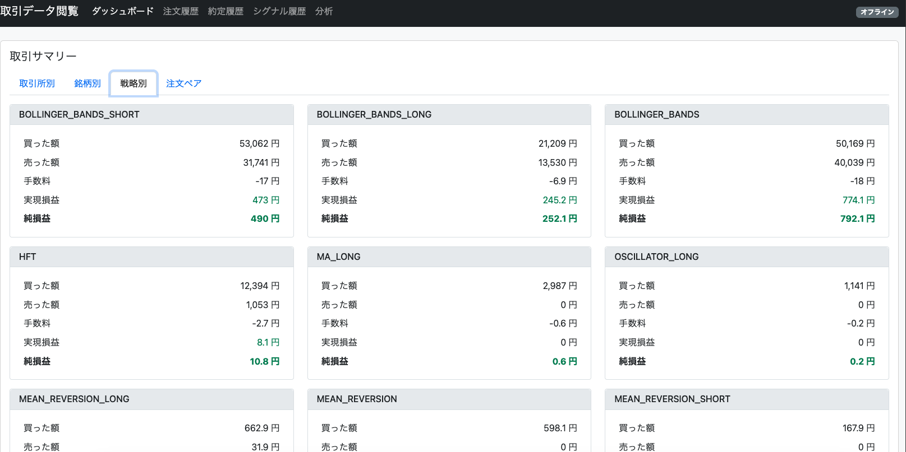

# 暗号通貨取引ボット (harvest3)

このプロジェクトは、複数の取引戦略を実装した暗号通貨取引ボット (`harvest3`) です。ccxtライブラリを使用して、複数の取引所（bitbank、bitflyer）に接続し、自動取引を行います。**Redis**データベースを使用してリアルタイムな取引記録、ポジション、イベントなどを管理し、**MongoDB**データベースを使用して注文、約定、シグナルなどの履歴データを永続化します。Web UIを通じてリアルタイムな状態監視や履歴確認が可能です。

## 主な機能

-   複数の取引戦略を並行して実行可能
-   複数の取引所 (Bitbank, Bitflyer) に対応
-   環境変数による柔軟な設定変更
-   Discordへの通知機能 (エラー、注文、損益レポート)
-   **Redis** および **MongoDB** データベースによるデータ永続化と管理
-   Web UIによるリアルタイム監視と履歴表示
-   Dockerによる簡単なデプロイと実行

## 実装されている戦略

`src/config.js` または環境変数 (`STRATEGY_*_ENABLED=true/false`) で各戦略の有効/無効を切り替えられます。

### トレンドフォロー戦略 (`strategies/trendFollowing.js`, `strategies/indicators.js`)

-   **移動平均線クロス (MA)**: 短期と長期の移動平均線が交差する点を売買シグナルとします。
-   **MACD (Moving Average Convergence Divergence)**: 2つの移動平均線の差と、その移動平均線を利用してトレンドの方向性や勢いを判断します。
-   **RSI (Relative Strength Index)**: 買われすぎや売られすぎの水準を判断し、反転を狙います。
-   **ボリンジャーバンド (BOLLINGER_BANDS)**: 価格の変動幅を統計的に捉え、上限や下限に達した際に逆張りをする戦略や、バンド幅の拡大でトレンドの発生を予測します。

### 逆張り戦略 (`strategies/meanReversion.js`, `strategies/indicators.js`)

-   **平均回帰 (MEAN_REVERSION)**: 価格は長期的には平均値に戻るという考えに基づき、大きく乖離した際に逆張りをする戦略です。
-   **オシレーター (OSCILLATOR)**: RSIやストキャスティクスなどのオシレーター系指標が買われすぎや売られすぎの水準を示す際に、反転を狙います。

### アービトラージ戦略 (`strategies/arbitrage.js`)

-   **取引所間アービトラージ (INTER_EXCHANGE_ARBITRAGE)**: 複数の取引所間でビットコインの価格差が生じた際に、安い取引所で買って高い取引所で売ることで利益を得ます。

### 高頻度取引 (HFT) (`strategies/highFrequency.js`, `src/hftBot.js`)

-   **高頻度取引 (HFT)**: 極めて短い時間間隔で大量の取引を行い、小さな利益を積み重ねます。専用の起動スクリプト (`npm run start-hft`) があります。

### マーケットメイキング (`strategies/marketMaking.js`, `src/mmBot.js`)

-   **マーケットメイキング (MARKET_MAKING)**: 買値と売値の両方の注文を同時に出し、スプレッドから利益を得る戦略です。専用の起動スクリプト (`npm run start-mm`) があります。

### その他戦略

-   **INYO戦略 (`strategies/inyo.js`)**: 詳細不明。
-   **スキャルピング (SCALPING)**: スプレッドに基づいて取引を行う戦略ですが、デフォルトでは無効 (`enabled: false`) になっています。

## セットアップ

### 前提条件

-   Node.js (v16以上推奨)
-   npm
-   Docker および Docker Compose (Dockerで実行する場合)
-   BitbankとBitflyerのAPIキー
-   Discord Webhook URL (通知機能を利用する場合)
-   **Redis サーバー**
-   **MongoDB サーバー**

### インストール

1.  リポジトリをクローン
    ```bash
    git clone <リポジトリURL>
    cd harvest3
    ```
2.  依存関係をインストール
    ```bash
    npm install
    ```
3.  環境変数の設定
    `.env.example`ファイルを`.env`にコピーし、必要な情報を入力します。
    ```bash
    cp .env.example .env
    ```
    `.env`ファイルを編集して、APIキー、Discord Webhook URL、**およびデータベース接続情報**を設定します。

    ```dotenv
    # 取引所APIキー
    BB_API_KEY=your_bitbank_api_key
    BB_API_SECRET=your_bitbank_api_secret
    BF_API_KEY=your_bitflyer_api_key
    BF_API_SECRET=your_bitflyer_api_secret

    # Discord通知用Webhook URL (任意)
    DISCORD_ERROR_WEBHOOK_URL=your_discord_webhook_url_for_errors
    DISCORD_ORDER_WEBHOOK_URL=your_discord_webhook_url_for_orders
    DISCORD_RESULT_WEBHOOK_URL=your_discord_webhook_url_for_results

    # Redis接続URL (Docker Composeを使用しない場合や、外部Redisサーバーを使用する場合に設定)
    REDIS_URL=redis://localhost:6379

    # MongoDB接続設定 (Docker Composeを使用しない場合や、外部MongoDBサーバーを使用する場合に設定)
    MONGO_URL=mongodb://localhost:27017
    MONGO_DB_NAME=harvest3

    # 戦略の有効/無効フラグ (任意、デフォルトはconfig.jsの値)
    # 例: STRATEGY_MA_ENABLED=true
    # STRATEGY_MACD_ENABLED=false
    # ... (他の戦略も同様)
    ```
    **注意:** `.env` ファイルに機密情報（APIキーなど）を記述するため、このファイルをGitリポジトリにコミットしないでください (`.gitignore` に含まれていることを確認してください)。

## 実行

### 通常実行

-   **標準ボット (bot.js):** 設定ファイル (`src/config.js`) で有効になっている戦略を実行します。
    ```bash
    npm start
    ```
-   **高頻度取引ボット (src/hftBot.js):** HFT戦略に特化したボットを実行します。
    ```bash
    npm run start-hft
    ```
-   **マーケットメイキングボット (src/mmBot.js):** マーケットメイキング戦略に特化したボットを実行します。
    ```bash
    npm run start-mm
    ```
-   **Web UIサーバー (src/api/index.js):** Web UI用のAPIサーバーを起動します。
    ```bash
    npm run start-web
    ```

### Dockerでの実行

`docker-compose.yml` を使用して、各サービスをコンテナとして実行できます。

-   **すべてのサービス (bot, hft, mm, web-ui, redis, mongo) を起動:**
    ```bash
    docker compose up -d
    ```
-   **特定のサービスのみを起動:**
    ```bash
    # 標準ボットのみ起動
    docker compose up -d bot

    # HFTボットのみ起動
    docker compose up -d hft

    # マーケットメイキングボットのみ起動
    docker compose up -d mm

    # Web UIのみ起動 (通常は他のボットと併用)
    docker compose up -d web-ui

    # Redisサーバーのみ起動
    docker compose up -d redis

    # MongoDBサーバーのみ起動
    docker compose up -d mongo
    ```
-   **ログの確認:**
    ```bash
    docker compose logs -f <サービス名> # 例: docker compose logs -f bot
    ```
-   **停止:**
    ```bash
    docker compose down
    ```

## レポート機能

Discord Webhookが設定されている場合、以下のレポートが送信されます。

1.  **全体資産計算レポート:** 1時間ごとに、各取引所の全資産をJPY換算で計算し、Discordに投稿します。
2.  **戦略と銘柄ごとの損益レポート:** 1時間ごとに、各取引所の戦略と銘柄ごとの損益、保有量、評価額などを計算し、Discordに投稿します。

## 設定

共通設定や各戦略のパラメータは `src/config.js` ファイル内の `config` オブジェクトで設定します。

```javascript
const config = {
  // 共通設定
  amount: 0.0001,          // 注文するBTCの量（固定値、tradePercentageが優先される）
  profitMargin: 0.003,     // 目標利益率（取引料を考慮）
  maxHistoryLength: 100,   // スプレッド履歴の最大長
  tradePercentage: 0.01,   // 資金の%で取引 (購入時)
  sellPercentage: 0.1,    // 資金の%で取引 (売却時)
  tradeCost: 0.0012,       // 手数料暫定（bitbank)
  cancelOrderThreshold: 10,// 一銘柄ごとの注文限度数
  safetyJPYAmount: 2000,   // JPY残高がこの額を下回ったら購入しない(HFTのときのみ)
  amountPrecision: 8,      // 取引量の小数点以下の桁数（デフォルト値）

  // 戦略固有の設定
  strategies: {
    // 各戦略の有効/無効フラグとパラメータ
    MA: {
      enabled: process.env.STRATEGY_MA_ENABLED === 'true', // 環境変数でも制御可能
      shortPeriod: 5,
      longPeriod: 20
    },
    // ... 他の戦略設定
  }
};
```

戦略の有効/無効 (`enabled`) は、`.env` ファイルで `STRATEGY_<戦略名>_ENABLED=true/false` のように設定することで、`config.js` の設定を上書きできます。

## データベース

このボットは、データの種類に応じて **Redis** と **MongoDB** の両方のデータベースを利用します。特に、リアルタイム性の高いデータ処理にはRedisを中心に活用しています。

-   **Redis:** リアルタイムな取引記録、現在のポジション情報、イベント通知、各種サマリー情報など、高速な読み書きやPub/Sub機能が活用されるデータに使用されます。これらのデータは主にボットの現在の状態監視やリアルタイムなWeb UI表示に利用され、システムの中核を担います。
-   **MongoDB:** 注文履歴 (`orders`)、約定履歴 (`trades`)、戦略シグナル (`signals`) など、永続的に保存し、後から詳細な分析や履歴確認を行うための履歴データに使用されます。

データベースサーバーへの接続情報は `.env` ファイルまたは環境変数で設定します。

**主な利用方法:**

-   **Redis:**
    -   取引履歴 (リアルタイム)
    -   約定履歴 (リアルタイム)
    -   ポジション管理 (リアルタイム)
    -   イベント通知 (Pub/Sub)
    -   サマリー情報 (リアルタイム損益、資産状況など)
-   **MongoDB:**
    -   注文履歴 (`orders` コレクション)
    -   約定履歴 (`trades` コレクション)
    -   戦略シグナル (`signals` コレクション)

**注意:** Dockerを使用している場合、RedisおよびMongoDBのデータは通常ボリュームに永続化されるように設定されています (`docker-compose.yml` を参照)。これにより、コンテナを再作成してもデータは保持されます。

## Web UI

Web UIが実装されており、Webブラウザからボットの状態を監視したり、履歴を確認したりすることができます。

### 概要

-   **ダッシュボード (`/`)**: 現在のサマリー情報（総資産、損益など）。
-   **ポジション (`/positions.html`)**: 現在保有しているポジションの状況（通貨ペア、数量、平均取得価格、評価損益など）をリアルタイムで確認できます。
-   **取引履歴 (`/history.html`)**: ボットが実行した注文の履歴（作成、更新、キャンセルなど）を確認できます。**MongoDBに保存された履歴も表示される可能性があります。**
-   **約定履歴 (`/filled-history.html`)**: 実際に約定した取引の履歴を詳細に確認できます。フィルタリングやソートも可能です。**MongoDBに保存された履歴も表示される可能性があります。**
-   **分析 (`/analysis.html`)**: 損益グラフや取引統計など、ボットのパフォーマンスを分析するための情報を提供します。 (現在開発中または機能限定の可能性あり)
-   **リアルタイムイベント**: Web UI は Redis Pub/Sub を通じてバックエンドからのイベント（ポジション更新、新規約定など）をリアルタイムに受信し、表示を更新します。APIエンドポイント (`/api/redis-events` など) 経由で Server-Sent Events (SSE) として配信されます。

### 使い方

1.  **Redisサーバー** および **MongoDBサーバー** が起動していることを確認します。Docker Compose を使用している場合は、通常 `web-ui` サービスと一緒に起動されます。
2.  ボット (例: `bot`, `hft`, `mm` のいずれか) と Web UI サーバー (`web-ui` または `npm run start-web`) を起動します。
    ```bash
    # Dockerの場合 (Redis, MongoDBも同時に起動)
    docker compose up -d bot web-ui
    # または 通常実行の場合 (別々のターミナルで、事前にRedisとMongoDBが起動している必要あり)
    # npm start
    # npm run start-web
    ```
3.  Webブラウザで `http://localhost:3000` にアクセスします。

### スクリーンショット


(スクリーンショットは `src/web/assets/screenshot.png` にあります。)

## テスト

いくつかのテスト用スクリプトが用意されています。

-   **注文ステータス確認:**
    ```bash
    npm run check-order-status
    ```

## 注意事項

-   実際の取引に使用する場合は、自己責任で行ってください。
-   暗号通貨取引には高いリスクが伴います。投資は自己責任で行ってください。
-   APIキーは他人に漏れないように厳重に管理してください。
-   レポート機能やWeb UIの表示は参考情報であり、実際の損益と完全に一致しない場合があります。
-   戦略ごとの損益は、その戦略が行った取引のみを対象としており、手数料や他の要因は考慮されていない場合があります。
-   **MongoDBのデータ永続化設定を確認し、必要に応じてボリューム設定などを適切に行ってください。**

## ライセンス

MIT
