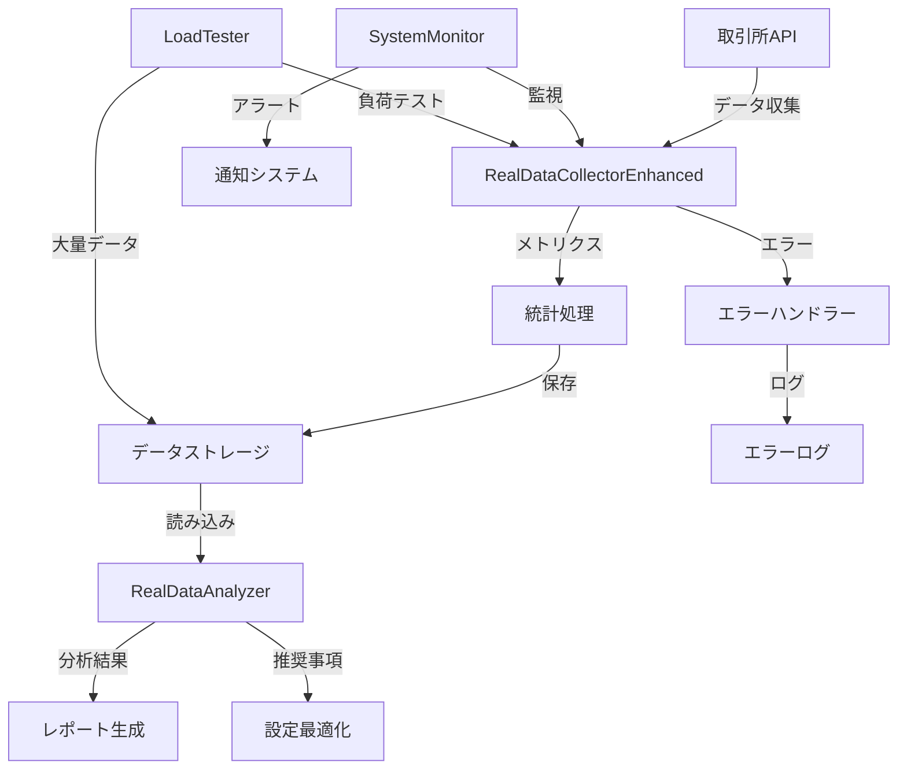

# 実データ収集・分析システム アーキテクチャドキュメント

## 概要

本ドキュメントは、harvest3プロジェクトにおける実データ収集・分析システムのアーキテクチャ、設計思想、実装詳細を記述します。このシステムは、理論値から実証値への移行を実現し、取引システムの信頼性と堅牢性を向上させることを目的としています。

## 目次

1. [システム概要](#システム概要)
2. [アーキテクチャ設計](#アーキテクチャ設計)
3. [主要コンポーネント](#主要コンポーネント)
4. [データフロー](#データフロー)
5. [エラーハンドリング](#エラーハンドリング)
6. [セキュリティ](#セキュリティ)
7. [パフォーマンス](#パフォーマンス)
8. [運用手順](#運用手順)
9. [トラブルシューティング](#トラブルシューティング)

## システム概要

### 目的

- **理論値検証**: 設定された閾値やパラメータの実環境での有効性検証
- **異常検知**: API障害、ネットワーク問題、パフォーマンス劣化の早期発見
- **最適化**: 実データに基づく設定値の継続的改善
- **可視性向上**: システム健全性の定量的把握

### 設計原則

1. **耐障害性**: 部分的な障害が全体に波及しない設計
2. **拡張性**: 新しい取引所やメトリクスの追加が容易
3. **自己修復**: エラーからの自動回復メカニズム
4. **監査可能性**: すべての動作がログとして記録・追跡可能

## アーキテクチャ設計

### 階層構造

```
┌─────────────────────────────────────────────────────┐
│                  Application Layer                   │
│  (Scripts: start-real-data-collection.js, etc.)     │
├─────────────────────────────────────────────────────┤
│                 Monitoring Layer                     │
│  (RealDataCollectorEnhanced, SystemMonitor)         │
├─────────────────────────────────────────────────────┤
│                  Analysis Layer                      │
│  (RealDataAnalyzer, ThresholdOptimizer)            │
├─────────────────────────────────────────────────────┤
│                 Persistence Layer                    │
│  (JSON Files, Error Logs, Backup System)           │
└─────────────────────────────────────────────────────┘
```

### コンポーネント関係図



## 主要コンポーネント

### 1. RealDataCollectorEnhanced

**責務**: 取引所からのデータ収集、エラーハンドリング、統計処理

**主要機能**:
- リトライ機構（指数バックオフ）
- タイムアウト処理
- エラー分類とロギング
- リアルタイム統計計算

**設定パラメータ**:
```javascript
{
    collectionInterval: 60000,      // データ収集間隔（ms）
    dataRetention: 2592000000,      // データ保持期間（30日）
    maxRetries: 3,                  // 最大リトライ回数
    retryDelay: 1000,              // 初期リトライ遅延（ms）
    backoffMultiplier: 2,          // バックオフ倍率
    apiTimeout: 10000,             // APIタイムアウト（ms）
    errorThreshold: 0.1,           // エラー率警告閾値（10%）
    criticalErrorThreshold: 0.3    // エラー率緊急閾値（30%）
}
```

### 2. RealDataAnalyzer

**責務**: 収集データの分析、理論値との比較、推奨事項生成

**分析メトリクス**:
- 応答時間パーセンタイル（P50, P90, P95, P99）
- 成功率・エラー率
- エラー種別分布
- システムリソース使用状況

### 3. LoadTester

**責務**: 統計的有意性を確保するための大量データ生成

**シミュレーションプロファイル**:
- `normal`: 通常運用（成功率98%）
- `high_load`: 高負荷状態（成功率85%）
- `unstable`: 不安定状態（成功率70%）
- `maintenance`: メンテナンス（成功率5%）

## データフロー

### 収集フロー

1. **初期化**: 既存データ読み込み、ディレクトリ確保
2. **収集ループ**:
   ```
   for each 収集間隔:
       for each 取引所:
           try:
               メトリクス収集（リトライ付き）
               成功統計更新
           catch error:
               エラー分類・記録
               失敗統計更新
       データポイント保存
       古いデータ削除
       統計情報更新
   ```
3. **永続化**: JSON形式でファイル保存、定期バックアップ

### 分析フロー

1. **データ読み込み**: 収集済みデータと理論値データ
2. **統計処理**: 基本統計量、パーセンタイル計算
3. **比較分析**: 理論値vs実測値の乖離検出
4. **推奨事項生成**: 最適閾値の算出
5. **レポート出力**: JSON形式で結果保存

## エラーハンドリング

### エラー分類

| エラータイプ | 説明 | 重要度 | 対処法 |
|------------|------|--------|-------|
| `timeout` | API応答タイムアウト | High | リトライ、バックオフ |
| `network` | ネットワーク接続エラー | Critical | リトライ、アラート |
| `rate_limit` | レート制限超過 | Medium | バックオフ、間隔調整 |
| `authentication` | 認証エラー | Critical | 設定確認、アラート |
| `invalid_response` | 不正なレスポンス形式 | Medium | ログ記録、スキップ |
| `unknown` | その他のエラー | Low | ログ記録 |

### リトライ戦略

```javascript
retry_delay = initial_delay * (backoff_multiplier ^ retry_count)
max_delay = 30000ms
```

### エラー率監視

- **警告閾値（10%）**: ログ出力、イベント発火
- **緊急閾値（30%）**: 緊急アラート、自動対処検討

## セキュリティ

### APIキー管理

1. **環境変数使用**: `.env`ファイルでの管理
2. **権限制限**: 読み取り専用APIキーの使用推奨
3. **ローテーション**: 定期的なキー更新

### データ保護

1. **ローカル保存**: 機密情報を含まないメトリクスのみ
2. **アクセス制御**: ファイル権限の適切な設定
3. **バックアップ**: 暗号化推奨

### 設定例（.env）

```bash
# API設定（実際の値は環境に応じて設定）
EXCHANGE_API_TIMEOUT=10000
EXCHANGE_MAX_RETRIES=3

# データ収集設定
COLLECTION_INTERVAL=60000
DATA_RETENTION_DAYS=30

# アラート設定
ERROR_THRESHOLD=0.1
CRITICAL_ERROR_THRESHOLD=0.3

# セキュリティ設定
ENABLE_ENCRYPTION=true
LOG_SENSITIVE_DATA=false
```

## パフォーマンス

### メモリ使用量

- **基本使用量**: ~50MB（Node.js プロセス）
- **データキャッシュ**: 最大100MB（設定可能）
- **ガベージコレクション**: 自動、古いデータの定期削除

### CPU使用率

- **通常時**: <5%（1分間隔の収集）
- **分析時**: ~20%（数千件のデータ処理）
- **最適化**: 非同期処理、バッチ処理

### ストレージ

- **データファイル**: ~1MB/日（3取引所、1分間隔）
- **エラーログ**: 最大10MB（ローテーション）
- **バックアップ**: 自動削除（保持期間設定可能）

## 運用手順

### 初期セットアップ

```bash
# 1. 依存関係インストール
npm install

# 2. 設定ファイル作成
cp .env.example .env
# .envを編集して適切な値を設定

# 3. ディレクトリ作成
mkdir -p data/load-test
```

### 通常運用

```bash
# データ収集開始
npm run collect-real-data

# バックグラウンド実行（推奨）
nohup npm run collect-real-data > collection.log 2>&1 &

# 状態確認
tail -f data/collection-status.json

# 分析実行
npm run analyze-real-data
```

### 負荷テスト

```bash
# 統計的有意性確保のための大量データ生成
node scripts/load-test-data-collection.js

# 結果確認
cat data/load-test/load-test-final-report.json
```

## トラブルシューティング

### よくある問題と対処法

#### 1. 「throttle queue is over maxCapacity」エラー

**原因**: API呼び出し頻度が高すぎる

**対処法**:
```bash
# 収集間隔を延長
export COLLECTION_INTERVAL=120000  # 2分

# 同時実行数を制限
export MAX_CONCURRENT_EXCHANGES=1
```

#### 2. メモリ不足エラー

**原因**: データ蓄積によるメモリ圧迫

**対処法**:
```bash
# Node.jsのメモリ上限を増やす
node --max-old-space-size=4096 scripts/start-real-data-collection.js

# データ保持期間を短縮
export DATA_RETENTION_DAYS=7
```

#### 3. ファイルサイズ警告

**原因**: 長期間の運用によるデータ蓄積

**対処法**:
- 自動削除機能が動作することを確認
- 必要に応じて手動でバックアップ・削除
- `maxFileSize`設定の調整

### ログ確認

```bash
# エラーログ確認
tail -f data/error-log.json | jq '.'

# 収集状況確認
watch -n 5 'cat data/collection-status.json | jq ".stats"'

# 統計サマリー表示
node -e "
const data = require('./data/enhanced-performance-data.json');
console.log('Total points:', data.measurements.length);
console.log('Success rate:', (data.statistics.successfulAttempts / data.statistics.totalAttempts * 100).toFixed(2) + '%');
"
```

## 今後の拡張予定

1. **機械学習統合**: 異常検知の自動化
2. **リアルタイムダッシュボード**: Grafana連携
3. **アラート強化**: Slack/Discord通知
4. **分散処理**: 複数ノードでの並列収集
5. **データベース統合**: 時系列DB（InfluxDB）対応

---

最終更新: 2025年07月04日  
バージョン: 2.0.0