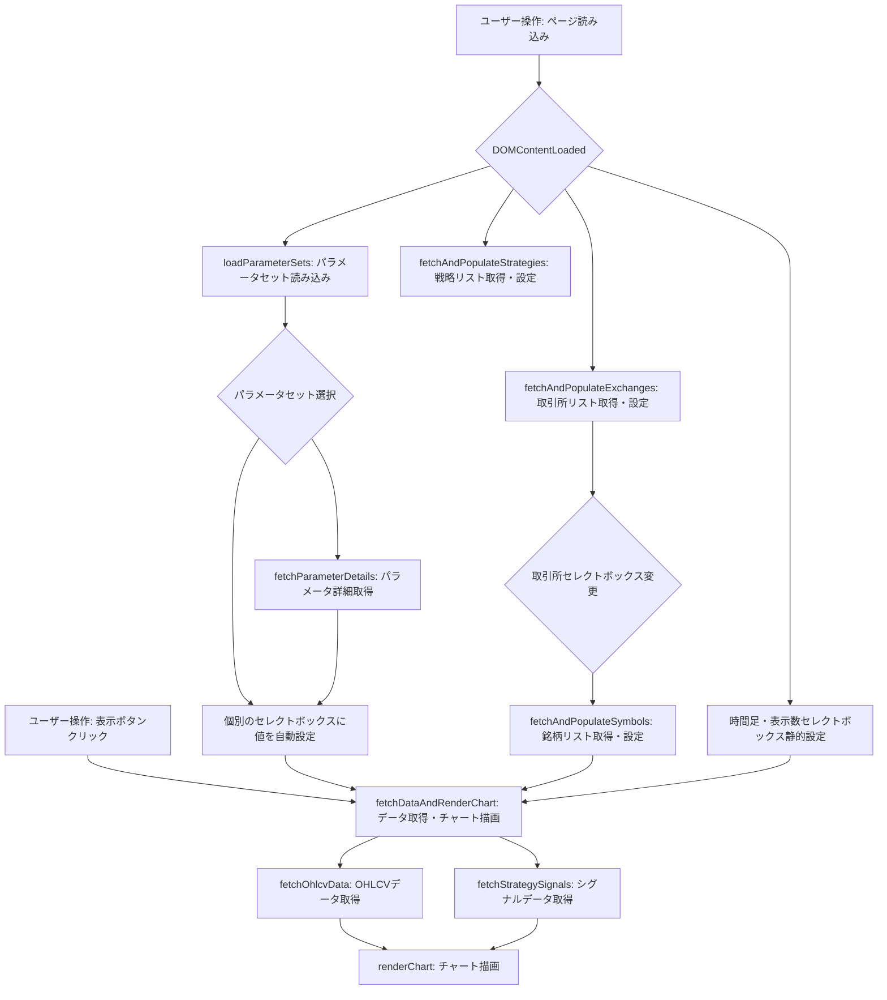

# 分析ページ フィルタ機能改修計画

## 目的

`src/web/js/analysis.js` および `src/web/analysis.html` を修正し、現在パラメータセット選択によって決定されている取引所、銘柄、戦略、時間足、表示数を、ユーザーが個別のセレクトボックスで選択できるようにする。

## 現状分析

- `src/web/analysis.html` には、パラメータセットを選択するセレクトボックスと基準日入力、「表示」ボタンがある。
- 「選択中:」として取引所、銘柄、戦略、時間足、表示数が表示されているが、これらはパラメータセット選択時にJavaScriptによって更新される静的なテキスト要素である。
- `src/web/js/analysis.js` の `fetchDataAndRenderChart` 関数は、これらの静的テキスト要素から値を取得してAPI呼び出しに使用している。
- `loadParameterSets` 関数は、パラメータセットのリストを取得し、`filter-parameter-set` セレクトボックスに設定する。パラメータセット選択時には、対応する「選択中:」のテキスト要素を更新し、パラメータ詳細APIから時間足と表示数を取得して同様に更新している。

## 改修計画詳細

1.  **`src/web/analysis.html` の変更:**
    *   フィルタエリア (`
`) 内に、以下の新しい `<select>` 要素を追加する。
        *   取引所選択 (`id="filter-exchange"`)
        *   銘柄選択 (`id="filter-symbol"`)
        *   戦略選択 (`id="filter-strategy"`)
        *   時間足選択 (`id="filter-timeframe"`)
        *   表示数選択 (`id="filter-limit"`)
    *   既存の「選択中:」を表示している `
` を削除または非表示にする。
    *   パラメータセットを選択する `<select id="filter-parameter-set">` はそのまま残し、個別のセレクトボックスへの自動設定機能に利用する。

2.  **`src/web/js/analysis.js` の変更:**
    *   新しいセレクトボックス要素への参照を取得する変数を追加する。
    *   `DOMContentLoaded` イベント内で、以下の処理を追加・修正する。
        *   `fetchAndPopulateExchanges` 関数を呼び出し、取引所セレクトボックスにオプションを設定する。
        *   `populateStrategies` 関数を呼び出し、戦略セレクトボックスにオプションを設定する。
        *   時間足セレクトボックス (`filter-timeframe`) に、一般的な時間足の選択肢（例: '1m', '5m', '15m', '30m', '1h', '4h', 8h, 12h, '1d', '1w' など）を静的に設定する。
        *   表示数セレクトボックス (`filter-limit`) に、一般的な表示数の選択肢（例: 20, 30, '50', '100', '200', '500', '1000' など）を静的に設定する。
    *   取引所セレクトボックス (`filter-exchange`) の `change` イベントリスナーを追加し、選択された取引所を引数に `fetchAndPopulateSymbols` 関数を呼び出し、銘柄セレクトボックスのオプションを更新するようにする。
    *   「表示」ボタンクリック時の `fetchDataAndRenderChart` 関数を修正し、以下の要素から選択値を取得するように変更する。
        *   取引所: `document.getElementById('filter-exchange').value`
        *   銘柄: `document.getElementById('filter-symbol').value`
        *   戦略: `document.getElementById('filter-strategy').value`
        *   時間足: `document.getElementById('filter-timeframe').value`
        *   表示数: `document.getElementById('filter-limit').value`
    *   `loadParameterSets` 関数を修正し、パラメータセットが選択された際に、以下の処理を行うように変更する。
        *   パラメータセットの値 (`exchange:symbol:strategy`) を分割し、取引所、銘柄、戦略のセレクトボックスの値を自動的に選択する。
        *   `fetchParameterDetails` 関数を呼び出し、パラメータセットの詳細から時間足と表示数を取得し、それぞれのセレクトボックスの値を自動的に選択する。
    *   不要になる `selected-exchange` などの `` 要素に関連するコード（要素の取得や `textContent` の更新部分）を削除する。

## 想定されるUIフロー

1.  ページ読み込み時、パラメータセット、取引所、戦略、時間足、表示数のセレクトボックスが初期化される。取引所選択に応じて銘柄セレクトボックスが更新される。
2.  ユーザーは個別のセレクトボックスで条件を選択し、「表示」ボタンをクリックする。
3.  または、ユーザーはパラメータセットを選択すると、個別のセレクトボックスが自動的に設定される。その後、「表示」ボタンをクリックする。
4.  「表示」ボタンクリック後、選択された条件に基づいてデータが取得され、チャートが表示される。

## Mermaid ダイアグラム

## 実装時の注意点

*   既存のコード（特にAPI呼び出し部分やチャート描画部分）への影響を最小限にするように変更を行う。
*   各セレクトボックスの初期状態や、選択肢がない場合のハンドリングを適切に行う。
*   パラメータセット選択時の自動設定と、個別のセレクトボックスでの手動選択の挙動が矛盾しないように注意する。
*   変更後は必ずテストを行い、意図した通りに動作することを確認する。