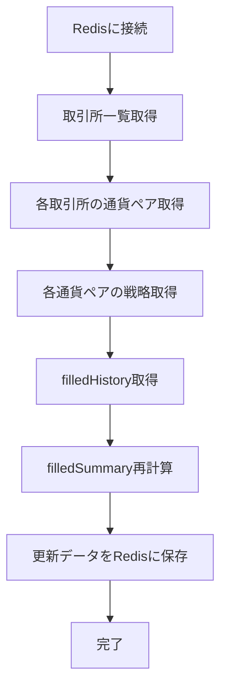

# FilledSummary更新スクリプト実装計画

## 概要

すべての`filledHistory`を取得して、それぞれの取引所、通貨ペア、戦略におけるfilledSummaryを最新化するスクリプトを実装します。このスクリプトはDocker Compose環境から実行可能にします。

## 現状の理解

1. システムはRedisデータベースを使用して取引データを管理しています
2. 重要な機能：
   - `addFilledTrade`: 約定記録追加とfilledSummary更新
   - `getFilledHistory`: 取引履歴取得
   - `getFilledSummary`: 約定サマリー取得
3. Docker構成：
   - redis: データベース
   - bot, hft, mm: 取引戦略実行ボット
   - web-ui: 管理インターフェース

## 処理フロー



## 実装詳細

### スクリプト: `scripts/updateFilledSummary.js`

1. **初期化**
   - Redisクライアントの初期化
   - ログ出力フォーマットの設定

2. **取引所・通貨ペア・戦略の取得**
   - `client.sMembers('exchanges')`で取引所一覧取得
   - 各取引所ごとに`client.sMembers(`symbols:${exchangeId}`)`で通貨ペア取得
   - 各通貨ペアごとに`client.sMembers(`strategies:${exchangeId}:${symbol}`)`で戦略取得

3. **filledHistoryの取得**
   - 各組み合わせごとに`client.lRange(`trade:filledHistory:${exchangeId}:${symbol}:${strategyKey}`, 0, -1)`で履歴取得

4. **filledSummaryの再計算**
   - 既存のfilledSummaryを取得（比較用）
   - 新しいfilledSummaryを初期値で作成
   - filledHistoryの全レコードを時系列順に処理
   - 各レコードに基づいてサマリー値を更新
   - 実現損益の計算

5. **更新データの保存**
   - 再計算したfilledSummaryをRedisに保存
   - タイムスタンプの更新

6. **詳細なログ出力**
   - 処理開始・終了のタイムスタンプ
   - 処理対象の取引所・通貨ペア・戦略の情報
   - 取得したfilledHistoryのレコード数
   - 更新前と更新後のfilledSummaryデータの差分
   - 処理された合計データ数
   - エラーが発生した場合の詳細情報

### Docker Compose: 新サービス追加

```yaml
update-summary:
  image: harvest3-bot-image
  container_name: update_filled_summary
  restart: "no"  # オンデマンド実行
  volumes:
    - ./src:/usr/src/app/src
    - ./strategies:/usr/src/app/strategies
    - ./scripts:/usr/src/app/scripts
    - ./data:/usr/src/app/data
    - ./package.json:/usr/src/app/package.json
    - .env:/usr/src/app/.env
  command: npm run update-summary
  environment:
    - REDIS_URL=redis://redis:6379
  networks:
    - harvest-network
  depends_on:
    - redis
```

### package.json: スクリプト追加

```json
{
  "scripts": {
    // 既存のスクリプト
    "update-summary": "node scripts/updateFilledSummary.js"
  }
}
```

## 実装上の注意点

- **パフォーマンス考慮**: 大量のデータ処理が予想されるため、メモリ使用量に注意
- **エラーハンドリング**: 各ステップでのエラー処理を適切に実装
- **トランザクション考慮**: 更新処理の整合性を保つための対策
- **ログ出力**: 詳細なログを出力し、どの取引所・通貨ペア・戦略が更新されたか確認可能に
- **実行周期**: オンデマンド実行を基本としつつ、必要に応じてCronなどでの定期実行も検討