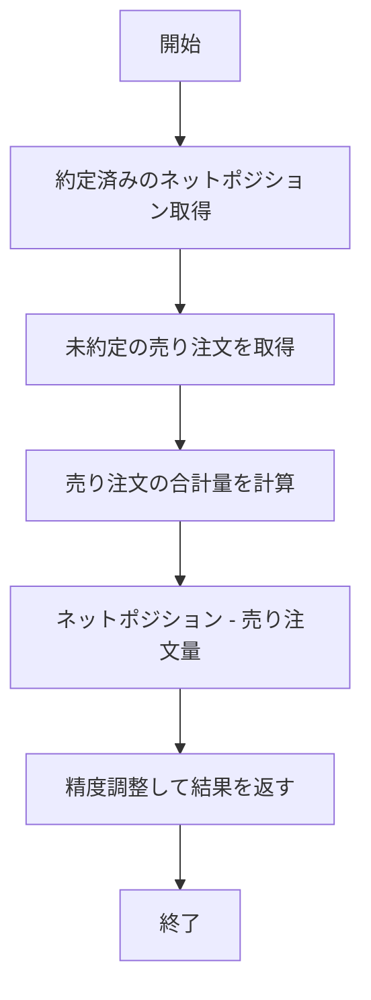

# formattedAvailableAmount 実装計画

## 現状分析

現在の `formatttedBuyAmount` 関数は約定済みの買った量と売った量の差（netposition）を返し、精度を考慮して値を丸めています。

```javascript
// 現在の実装
async function formatttedBuyAmount(exchange, symbol, strategyKey, amountPrecision) {
  // 取引記録から買った量を取得
  const buyAmount = await getFilledCurrentPosition(exchange, symbol, strategyKey);

  // 精度を考慮して、最小精度以上の値を確保
  return parseFloat(buyAmount.toFixed(amountPrecision));
}
```

しかし、この関数は未約定の売り注文を考慮していないため、実際に利用可能な数量が正確に反映されていません。

## 改修要件

1. `formatttedBuyAmount` を `formattedAvailableAmount` に置き換える
2. 未約定の売り注文（sell side）も考慮して、利用可能な数量を計算する
3. 現在のすべての呼び出し箇所で同じ引数で使えるようにする

## 実装計画

### 新関数の実装



1. `src/utils.js` に新しい関数 `formattedAvailableAmount` を実装する
2. 現在の `formatttedBuyAmount` と同じ引数を受け取る
3. `ccxt` の `fetchOpenOrders` メソッドを使って、未約定の注文を取得
4. 売り注文のみをフィルタリングし、その合計量を計算
5. 利用可能量 = ネットポジション - 未約定売り注文量
6. 精度を考慮して値を丸め、結果を返す

### コード修正

1. `formatttedBuyAmount` 関数は削除
2. `module.exports` を更新して `formattedAvailableAmount` をエクスポート
3. 以下のファイルで関数名とインポート文を変更:
   - `strategies/arbitrage.js`
   - `strategies/meanReversion.js`
   - `strategies/trendFollowing.js`

## リスクと考慮事項

1. **エラーハンドリング**: `fetchOpenOrders` が失敗した場合、エラーログを記録し、安全のために0を返す
2. **パフォーマンス**: API呼び出しが増えるため、パフォーマンスへの影響を考慮
3. **未約定注文の状態変化**: 注文状態が変わる可能性があり、最新の状態を確実に取得する必要がある

## 実装コード例

```javascript
async function formattedAvailableAmount(exchange, symbol, strategyKey, amountPrecision) {
  try {
    // 取引記録から買った量を取得（ネットポジション）
    const netPosition = await getFilledCurrentPosition(exchange, symbol, strategyKey);
    
    // 未約定の注文を取得
    const openOrders = await exchange.fetchOpenOrders(symbol);
    
    // 売り注文のみをフィルタリングして合計量を計算
    const totalSellOrderAmount = openOrders
      .filter(order => order.side === 'sell')
      .reduce((sum, order) => sum + order.amount, 0);
    
    // 利用可能量 = ネットポジション - 未約定売り注文量
    let availableAmount = netPosition - totalSellOrderAmount;
    
    // 負の値にならないようにする
    if (availableAmount < 0) availableAmount = 0;
    
    // 精度を考慮して、最小精度以上の値を確保
    return parseFloat(availableAmount.toFixed(amountPrecision));
  } catch (error) {
    console.error('利用可能量の計算に失敗しました:', error);
    // エラーとなった取引所とシンボルを記録
    const errorMessage = `formattedAvailableAmount実行中にエラーが発生しました: ${exchange.id} ${symbol} ${strategyKey}`;
    console.error(errorMessage, error);
    
    // エラー時は安全のために0を返す（より厳格な対応）
    return 0;
  }
}
```

## テスト計画

1. 未約定の売り注文がない場合: ネットポジションと同じ値が返るか
2. 未約定の売り注文がある場合: ネットポジション - 売り注文量 が正しく計算されるか
3. エラー発生時: エラーログが残され、0が返るか
4. 負の値になる場合: 0が返るか

## 実装スケジュール

1. `src/utils.js` に新関数を実装
2. 既存の関数を削除し、エクスポート修正
3. 参照している各ファイルの呼び出しを修正
4. テスト実行
5. デプロイ