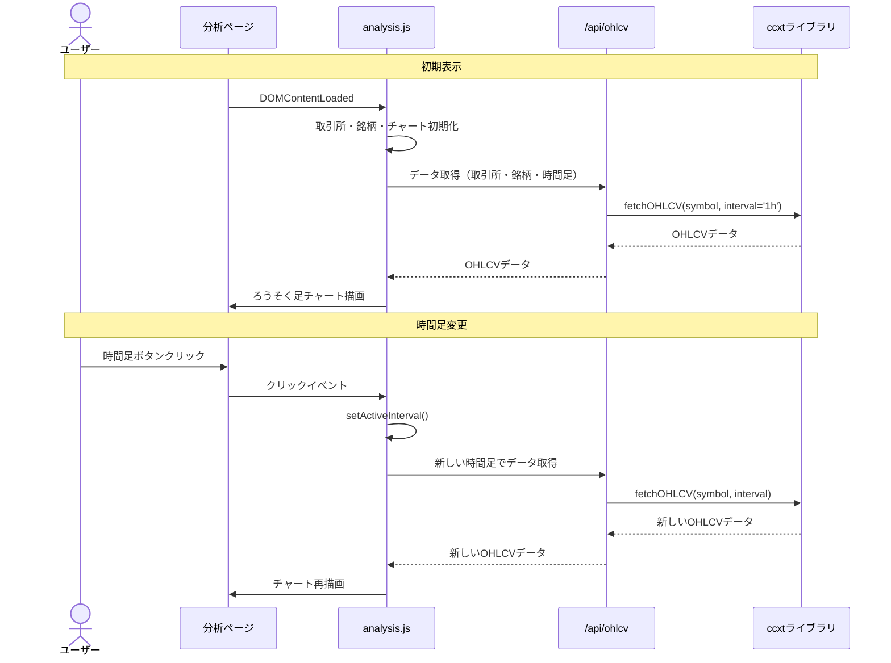

# ろうそく足チャート時間足選択機能実装計画

## 目標

分析ページのろうそく足チャートに、ユーザーが時間足を選択できる機能を実装する。
サポートする時間足は以下の通り：
- 1分足
- 5分足
- 15分足
- 1時間足（デフォルト）
- 4時間足
- 日足

## 現状分析

現在のろうそく足チャート実装では：

- `loadOhlcvData()` 関数内で時間足（interval）が固定値 `'1h'`（1時間足）として設定されている
- ユーザーが時間足を選択する方法がない
- `/api/ohlcv` エンドポイントは既に時間足パラメータ（interval）をサポートしている
- ccxtライブラリを使用して取引所からOHLCVデータを取得している

## 実装内容

### 1. HTML修正（src/web/analysis.html）

取引所と銘柄選択の下に時間足選択用のボタングループを追加します：

```html
<!-- 取引所・銘柄選択とろうそく足チャート -->
<div class="row mb-4">
  <div class="col-12">
    <div class="card">
      <div class="card-body">
        <h5 class="card-title">ろうそく足チャート</h5>
        <div class="row mb-3">
          <div class="col-md-3">
            <select id="exchange-select" class="form-select"></select>
          </div>
          <div class="col-md-3">
            <select id="symbol-select" class="form-select"></select>
          </div>
        </div>
        <!-- 時間足選択ボタングループの追加 -->
        <div class="row mb-3">
          <div class="col-12">
            <div class="btn-group" role="group" aria-label="時間足選択">
              <button type="button" class="btn btn-outline-primary interval-btn" data-interval="1m">1分</button>
              <button type="button" class="btn btn-outline-primary interval-btn" data-interval="5m">5分</button>
              <button type="button" class="btn btn-outline-primary interval-btn" data-interval="15m">15分</button>
              <button type="button" class="btn btn-primary interval-btn" data-interval="1h">1時間</button>
              <button type="button" class="btn btn-outline-primary interval-btn" data-interval="4h">4時間</button>
              <button type="button" class="btn btn-outline-primary interval-btn" data-interval="1d">日足</button>
            </div>
          </div>
        </div>
        <div class="chart-container" style="position: relative; height:400px;">
          <canvas id="ohlc-chart"></canvas>
        </div>
      </div>
    </div>
  </div>
</div>
```

### 2. JavaScript修正（src/web/js/analysis.js）

以下の修正を行います：

#### 2.1. グローバル変数の追加

```javascript
// グローバル変数
let currentPeriod = 'daily';
let currentInterval = '1h'; // デフォルトは1時間足
let charts = {
  // 既存のチャート定義...
};
```

#### 2.2. 時間足選択機能の実装

```javascript
/**
 * 選択された時間足を設定する
 * @param {string} interval - 時間足（例: '1m', '5m', '15m', '1h', '4h', '1d'）
 */
function setActiveInterval(interval) {
  currentInterval = interval;
  
  // ボタンのアクティブ状態を更新
  document.querySelectorAll('.interval-btn').forEach(btn => {
    if (btn.getAttribute('data-interval') === interval) {
      btn.classList.remove('btn-outline-primary');
      btn.classList.add('btn-primary');
    } else {
      btn.classList.remove('btn-primary');
      btn.classList.add('btn-outline-primary');
    }
  });
  
  // 選択された時間足でチャートを更新
  loadOhlcvData();
}
```

#### 2.3. OHLCV取得関数の修正

```javascript
async function loadOhlcvData() {
  const exchange = document.getElementById('exchange-select').value;
  const symbol = document.getElementById('symbol-select').value;
  const interval = currentInterval; // グローバル変数から時間足を取得
  const limit = 100;
  
  if (!exchange || !symbol) return;
  
  try {
    const params = new URLSearchParams({ exchange, symbol, interval, limit });
    const res = await fetch(`/api/ohlcv?${params.toString()}`);
    const data = await res.json();
    
    if (!data || data.length === 0) {
      updateOhlcChart([]);
      return;
    }
    
    // Chart.js Financial形式に変換
    const ohlcvData = data.map(item => ({
      x: item[0], o: item[1], h: item[2], l: item[3], c: item[4]
    }));
    
    updateOhlcChart(ohlcvData);
  } catch (e) {
    console.error('ローソク足データの取得に失敗しました:', e);
    updateOhlcChart([]);
  }
}
```

#### 2.4. チャート更新関数の修正

```javascript
function updateOhlcChart(ohlcvData) {
  const ctx = document.getElementById('ohlc-chart').getContext('2d');
  
  // 時間足に応じてX軸の表示形式を最適化
  let timeUnit = 'hour';
  let tooltipFormat = 'yyyy/MM/dd HH:mm';
  
  switch(currentInterval) {
    case '1m':
    case '5m':
    case '15m':
      timeUnit = 'minute';
      break;
    case '1h':
    case '4h':
      timeUnit = 'hour';
      break;
    case '1d':
      timeUnit = 'day';
      tooltipFormat = 'yyyy/MM/dd';
      break;
  }
  
  const chartOptions = {
    responsive: true,
    maintainAspectRatio: false,
    plugins: {
      title: { display: true, text: `ローソク足チャート（${getIntervalText(currentInterval)}）` }
    },
    scales: {
      x: { 
        type: 'time', 
        time: { 
          unit: timeUnit,
          tooltipFormat: tooltipFormat 
        } 
      },
      y: { beginAtZero: false }
    }
  };
  
  if (ohlcChart) {
    ohlcChart.data.datasets[0].data = ohlcvData;
    ohlcChart.options = chartOptions;
    ohlcChart.update();
    return;
  }
  
  ohlcChart = new Chart(ctx, {
    type: 'candlestick',
    data: {
      datasets: [{
        label: 'ローソク足',
        data: ohlcvData,
        color: {
          up: '#26a69a', down: '#ef5350', unchanged: '#ccc'
        }
      }]
    },
    options: chartOptions
  });
}

/**
 * 時間足の表示用テキストを取得
 */
function getIntervalText(interval) {
  const intervalMap = {
    '1m': '1分足',
    '5m': '5分足',
    '15m': '15分足',
    '1h': '1時間足',
    '4h': '4時間足',
    '1d': '日足'
  };
  return intervalMap[interval] || interval;
}
```

#### 2.5. イベントリスナーの追加

```javascript
document.addEventListener('DOMContentLoaded', () => {
  // 既存のコード...
  
  // 時間足選択ボタンのイベントリスナー設定
  document.querySelectorAll('.interval-btn').forEach(button => {
    button.addEventListener('click', (e) => {
      const interval = e.target.getAttribute('data-interval');
      setActiveInterval(interval);
    });
  });
  
  // 既存のコード...
});
```

## 実装フロー



## 動作確認事項

1. 画面初期表示時に1時間足のチャートが表示されること
2. 各時間足ボタンをクリックすると対応する時間足のチャートが表示されること
3. 取引所や銘柄を変更した後も、選択された時間足が維持されること
4. 時間足に応じてX軸のスケール設定が適切に変更されること

## 次のステップ

実装が完了したら、以下の拡張機能を検討することができます：

1. **テクニカル指標の追加**
   - 移動平均線、ボリンジャーバンドなどの基本的なテクニカル指標表示
   
2. **データ取得量の拡張**
   - スクロールによる過去データのロード機能
   
3. **リアルタイム更新機能**
   - 定期的なデータ更新によるチャートリフレッシュ