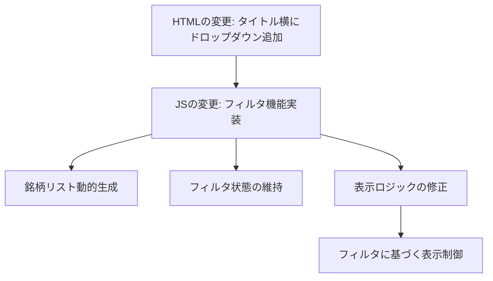

# 注文ペアサマリーへの銘柄フィルター実装計画

## 概要

注文ペアサマリーセクションに簡易な銘柄フィルター機能を追加します。ドロップダウンで銘柄を選択することで、特定の銘柄の注文ペアのみを表示できるようにします。

## 現状分析

現在の実装では:
- `index.html`の99-115行目に注文ペアサマリーセクションがある
- `dashboard.js`の654-768行目に`loadOrderPairsSummary()`関数がある
- フィルタリング機能はまだ実装されていない

## 実装計画



### 1. HTML変更

`index.html`の注文ペアサマリータイトル部分を修正し、タイトルの横にドロップダウンを追加します:

```html
<h5 class="card-title d-flex justify-content-between align-items-center">
    <span>注文ペアサマリー</span>
    <div class="d-flex align-items-center">
        <label for="symbol-filter" class="me-2">銘柄:</label>
        <select id="symbol-filter" class="form-select form-select-sm" style="width: auto;">
            <option value="all">すべて表示</option>
            <!-- 銘柄オプションは動的に生成 -->
        </select>
    </div>
</h5>
```

### 2. JavaScript変更

`dashboard.js`を修正し、以下の機能を実装します:

#### グローバル変数の追加

```javascript
// グローバル変数
let allOrderPairs = []; // すべての注文ペアデータを保持
let currentSymbolFilter = 'all'; // 現在選択されている銘柄フィルタ
```

#### ドロップダウン選択イベントの処理

```javascript
// ドロップダウン変更時の処理関数
function setupSymbolFilter() {
    const symbolFilter = document.getElementById('symbol-filter');
    if (symbolFilter) {
        symbolFilter.addEventListener('change', function() {
            currentSymbolFilter = this.value;
            displayFilteredOrderPairs();
        });
    }
}
```

#### 注文ペアサマリー読み込み関数の修正

現在の`loadOrderPairsSummary()`関数を修正して、以下の機能を追加:

1. APIからデータを取得したら全データをグローバル変数に保存
2. 銘柄リストを動的に生成してドロップダウンを更新
3. フィルタに基づいて表示を更新

#### 銘柄ドロップダウン更新関数

```javascript
function updateSymbolDropdown() {
    const symbolFilter = document.getElementById('symbol-filter');
    if (!symbolFilter) return;
    
    // 現在の選択値を保存
    const currentValue = symbolFilter.value;
    
    // ユニークな銘柄リストを取得
    const uniqueSymbols = [...new Set(allOrderPairs.map(item => item.symbol))].sort();
    
    // ドロップダウンの選択肢を更新（「すべて表示」オプションは維持）
    let options = '<option value="all">すべて表示</option>';
    uniqueSymbols.forEach(symbol => {
        options += `<option value="${symbol}">${symbol}</option>`;
    });
    
    symbolFilter.innerHTML = options;
    
    // 以前の選択値が存在すれば復元
    if (uniqueSymbols.includes(currentSymbolFilter) || currentSymbolFilter === 'all') {
        symbolFilter.value = currentSymbolFilter;
    } else {
        // 以前の選択値が存在しない場合は「すべて表示」に
        currentSymbolFilter = 'all';
        symbolFilter.value = 'all';
    }
}
```

#### フィルタに基づく表示関数

```javascript
function displayFilteredOrderPairs() {
    const container = document.getElementById('order-pairs-summary-container');
    
    // フィルタリング
    let filteredPairs = allOrderPairs;
    if (currentSymbolFilter !== 'all') {
        filteredPairs = allOrderPairs.filter(item => item.symbol === currentSymbolFilter);
    }
    
    if (filteredPairs.length === 0) {
        container.innerHTML = `
            <div class="no-data-message">
                <p>条件に一致する注文ペアはありません</p>
            </div>
        `;
        return;
    }
    
    // カードを生成（既存の表示ロジックを活用）
    let html = '';
    
    filteredPairs.forEach(item => {
        // 買い/売り注文情報を取得
        const buyOrder = item.pair.buyOrder || {};
        const sellOrder = item.pair.sellOrder || {};
        
        // ステータスバッジのスタイルを決定
        const getBadgeClass = (status) => {
            switch(status) {
                case 'open': return 'bg-primary';
                case 'closed': return 'bg-success';
                case 'canceled': return 'bg-warning';
                case 'expired': return 'bg-secondary';
                case 'rejected': return 'bg-danger';
                default: return 'bg-secondary';
            }
        };
        
        // 価格とステータスの表示を整形
        const buyPrice = buyOrder.price ? buyOrder.price.toLocaleString() : '-';
        const sellPrice = sellOrder.price ? sellOrder.price.toLocaleString() : '-';
        const buyStatus = buyOrder.status || '-';
        const sellStatus = sellOrder.status || '-';
        const amount = item.pair.amount || (buyOrder.amount || sellOrder.amount || 0);
        
        // 買い/売り注文の状態に応じたバッジスタイル
        const buyBadgeClass = getBadgeClass(buyStatus);
        const sellBadgeClass = getBadgeClass(sellStatus);
        
        // 日時表示
        const formatDate = (timestamp) => {
            if (!timestamp) return '-';
            const date = new Date(timestamp);
            return date.toLocaleString('ja-JP', {
                month: '2-digit',
                day: '2-digit',
                hour: '2-digit',
                minute: '2-digit'
            });
        };
        
        const buyDate = formatDate(buyOrder.timestamp);
        const sellDate = formatDate(sellOrder.timestamp);
        
        // カードHTMLを生成
        html += `
            <div class="order-pair-card">
                <h6>
                    ${item.symbol}
                    <small class="text-muted">${item.exchangeId}</small>
                </h6>
                <div class="small text-muted mb-2">${item.strategyKey}</div>
                
                <div class="price-info">
                    <span class="price-label">買価格:</span>
                    <span class="buy-price">${buyPrice}</span>
                </div>
                <div class="price-info">
                    <span class="price-label">売価格:</span>
                    <span class="sell-price">${sellPrice}</span>
                </div>
                
                <div class="small">数量: ${amount}</div>
                
                <div class="status">
                    <span>買: <span class="badge ${buyBadgeClass}">${buyStatus}</span></span>
                    <span>売: <span class="badge ${sellBadgeClass}">${sellStatus}</span></span>
                </div>
                
                <div class="metadata">
                    <div>買: ${buyDate}</div>
                    <div>売: ${sellDate}</div>
                </div>
            </div>
        `;
    });
    
    container.innerHTML = html;
}
```

#### 初期化関数に設定追加

```javascript
function initDashboard() {
    // 既存の初期化コード
    
    // 銘柄フィルターの設定
    setupSymbolFilter();
    
    // 以下は既存コード
}
```

## 実装上の考慮点

1. **動的銘柄セット対応**: 銘柄リストは動的に生成され、変更時に更新される
2. **フィルタ状態維持**: リアルタイム更新時もフィルタ状態を維持する
3. **UI配置**: タイトルの横にドロップダウンを配置してスペースを効率的に使用
4. **レスポンシブ対応**: モバイル表示でも適切に機能するレイアウト

## 変更が必要なファイル

1. `src/web/index.html` - 注文ペアサマリータイトル部分の修正
2. `src/web/js/dashboard.js` - フィルタリング機能の実装