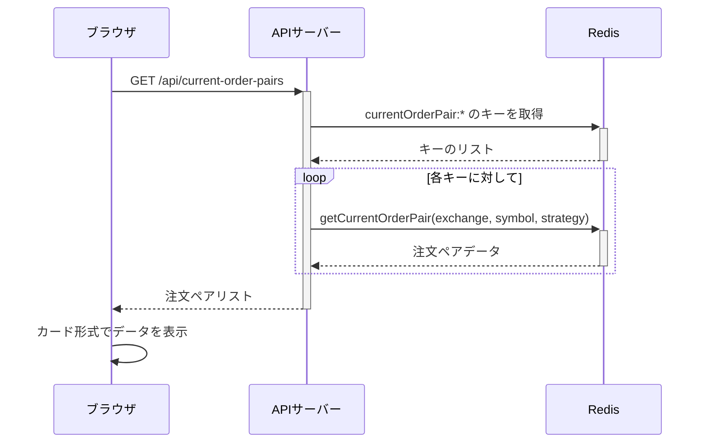

# 注文ペアサマリー表示機能の実装計画

## 1. 実装概要

現在の注文ペア情報をカード形式で表示するセクションを「最近の取引」セクションの上に追加します。各カードには取引所、銘柄、戦略の情報と、対応する買い/売り注文の状態を表示します。



## 2. 実装手順

### 2.1. APIの実装

#### 2.1.1. APIコントローラー作成

`src/api/controllers/redis-current-order-pairs.js` を作成します:

```javascript
/**
 * Redis版の現在の注文ペアを取得するコントローラー
 */
const { getCurrentOrderPair } = require('../../redisDatabase');
const { client } = require('../../redisClient');

/**
 * 現在の注文ペアを取得するコントローラー
 */
async function getCurrentOrderPairsController(req, res) {
  try {
    // 結果を格納する配列
    const allPairs = [];
    
    // currentOrderPairキーのパターンを使用して全てのキーを取得
    const keys = await client.keys('currentOrderPair:*');
    
    // 各キーから注文ペアを取得
    for (const key of keys) {
      // キーから取引所、通貨ペア、戦略を抽出
      const parts = key.split(':');
      if (parts.length !== 4) continue;
      
      const exchangeId = parts[1];
      const symbol = parts[2];
      const strategyKey = parts[3];
      
      // 注文ペアを取得
      const pair = await getCurrentOrderPair(exchangeId, symbol, strategyKey);
      
      // データがある場合のみ追加
      if (pair && Object.keys(pair).length > 0) {
        allPairs.push({
          exchangeId,
          symbol,
          strategyKey,
          pair
        });
      }
    }
    
    // 結果をJSON形式で返す
    res.json({
      currentOrderPairs: allPairs,
      total: allPairs.length
    });
  } catch (error) {
    console.error('現在の注文ペア取得エラー:', error);
    res.status(500).json({ error: 'サーバーエラーが発生しました' });
  }
}

module.exports = {
  getCurrentOrderPairs: getCurrentOrderPairsController
};
```

#### 2.1.2. APIルート追加

`src/api/redis-routes.js` に新しいルートを追加します:

```javascript
const { getCurrentOrderPairs } = require('./controllers/redis-current-order-pairs');

// 現在の注文ペアAPI
router.get('/current-order-pairs', getCurrentOrderPairs);
```

### 2.2. フロントエンド実装

#### 2.2.1. HTMLの追加

`src/web/index.html` に新しいセクションを追加します（98行目付近、「最近の取引」セクションの前に）:

```html
<!-- 注文ペアサマリー -->
<div class="row mb-4">
  <div class="col-12">
    <div class="card">
      <div class="card-body">
        <h5 class="card-title">注文ペアサマリー</h5>
        <div id="order-pairs-summary-container" class="order-pairs-cards">
          <div class="text-center py-5">
            <div class="spinner-border text-primary" role="status">
              <span class="visually-hidden">読み込み中...</span>
            </div>
          </div>
        </div>
      </div>
    </div>
  </div>
</div>
```

#### 2.2.2. CSSスタイルの追加（既存のCSSファイルに追加）

`src/web/css/style.css` に以下のスタイルを追加します:

```css
/* 注文ペアカード用のスタイル */
.order-pairs-cards {
  display: flex;
  flex-wrap: nowrap;
  overflow-x: auto;
  padding: 0.5rem 0;
  gap: 1rem;
}

.order-pair-card {
  min-width: 270px;
  margin-bottom: 0.5rem;
  flex: 0 0 auto;
  border: 1px solid #dee2e6;
  border-radius: 0.25rem;
  padding: 0.75rem;
  background-color: #f8f9fa;
  position: relative;
}

.order-pair-card h6 {
  margin-bottom: 0.5rem;
  font-weight: 600;
  display: flex;
  justify-content: space-between;
  align-items: center;
}

.order-pair-card .price-info {
  display: flex;
  justify-content: space-between;
  font-size: 0.9rem;
  margin-bottom: 0.25rem;
}

.order-pair-card .price-label {
  color: #6c757d;
}

.order-pair-card .buy-price {
  color: #198754;
}

.order-pair-card .sell-price {
  color: #dc3545;
}

.order-pair-card .status {
  display: flex;
  justify-content: space-between;
  font-size: 0.8rem;
  margin-top: 0.5rem;
}

.order-pair-card .metadata {
  color: #6c757d;
  font-size: 0.75rem;
  margin-top: 0.5rem;
  border-top: 1px solid #e9ecef;
  padding-top: 0.5rem;
}
```

#### 2.2.3. JavaScript関数の追加

`src/web/js/dashboard.js` に以下の関数を追加します:

```javascript
/**
 * 注文ペアサマリーを読み込んで表示
 */
function loadOrderPairsSummary() {
  const container = document.getElementById('order-pairs-summary-container');
  
  // ローディング表示
  container.innerHTML = `
    <div class="text-center py-5">
      <div class="spinner-border text-primary" role="status">
        <span class="visually-hidden">読み込み中...</span>
      </div>
    </div>
  `;
  
  // APIからデータ取得
  fetch('/api/current-order-pairs')
    .then(response => response.json())
    .then(data => {
      if (!data.currentOrderPairs || data.currentOrderPairs.length === 0) {
        container.innerHTML = `
          <div class="no-data-message">
            <p>注文ペアデータがありません</p>
          </div>
        `;
        return;
      }
      
      // カードを生成
      let html = '';
      
      data.currentOrderPairs.forEach(item => {
        // 買い/売り注文情報を取得
        const buyOrder = item.pair.buyOrder || {};
        const sellOrder = item.pair.sellOrder || {};
        
        // ステータスバッジのスタイルを決定
        const getBadgeClass = (status) => {
          switch(status) {
            case 'open': return 'bg-primary';
            case 'closed': return 'bg-success';
            case 'canceled': return 'bg-warning';
            case 'expired': return 'bg-secondary';
            case 'rejected': return 'bg-danger';
            default: return 'bg-secondary';
          }
        };
        
        // 価格とステータスの表示を整形
        const buyPrice = buyOrder.price ? buyOrder.price.toLocaleString() : '-';
        const sellPrice = sellOrder.price ? sellOrder.price.toLocaleString() : '-';
        const buyStatus = buyOrder.status || '-';
        const sellStatus = sellOrder.status || '-';
        const amount = item.pair.amount || (buyOrder.amount || sellOrder.amount || 0);
        
        // 買い/売り注文の状態に応じたバッジスタイル
        const buyBadgeClass = getBadgeClass(buyStatus);
        const sellBadgeClass = getBadgeClass(sellStatus);
        
        // 日時表示
        const formatDate = (timestamp) => {
          if (!timestamp) return '-';
          const date = new Date(timestamp);
          return date.toLocaleString('ja-JP', { 
            month: '2-digit', 
            day: '2-digit', 
            hour: '2-digit', 
            minute: '2-digit' 
          });
        };
        
        const buyDate = formatDate(buyOrder.timestamp);
        const sellDate = formatDate(sellOrder.timestamp);
        
        // カードHTMLを生成
        html += `
          <div class="order-pair-card">
            <h6>
              ${item.symbol}
              <small class="text-muted">${item.exchangeId}</small>
            </h6>
            <div class="small text-muted mb-2">${item.strategyKey}</div>
            
            <div class="price-info">
              <span class="price-label">買価格:</span>
              <span class="buy-price">${buyPrice}</span>
            </div>
            <div class="price-info">
              <span class="price-label">売価格:</span>
              <span class="sell-price">${sellPrice}</span>
            </div>
            
            <div class="small">数量: ${amount}</div>
            
            <div class="status">
              <span>買: <span class="badge ${buyBadgeClass}">${buyStatus}</span></span>
              <span>売: <span class="badge ${sellBadgeClass}">${sellStatus}</span></span>
            </div>
            
            <div class="metadata">
              <div>買: ${buyDate}</div>
              <div>売: ${sellDate}</div>
            </div>
          </div>
        `;
      });
      
      container.innerHTML = html;
    })
    .catch(error => {
      console.error('注文ペアサマリーの取得に失敗しました:', error);
      container.innerHTML = `
        <div class="alert alert-danger" role="alert">
          注文ペアサマリーの取得に失敗しました。詳細はコンソールを確認してください。
        </div>
      `;
    });
}
```

#### 2.2.4. 初期化時に読み込み関数を呼び出すよう修正

`loadDashboardData()` 関数内に注文ペアサマリーの読み込みを追加します:

```javascript
/**
 * ダッシュボードの全データを読み込む
 */
function loadDashboardData() {
  loadPositions();
  loadSummary();
  loadOrderPairsSummary(); // 追加
  loadRecentTrades();
}
```

#### 2.2.5. リアルタイム更新の設定

`setupRealtimeUpdates()` 関数内に注文ペア更新の処理を追加:

```javascript
/**
 * リアルタイム更新の設定
 */
function setupRealtimeUpdates() {
  // 既存のコード...
  
  // 注文ペア更新イベント
  realtimeUpdater.addListener('order_pair_updated', (data) => {
    // 注文ペアサマリーを更新
    loadOrderPairsSummary();
  });
}
```

## 3. 実装上の注意点

1. カードの横スクロールUIはモバイルでも使いやすいよう設計
2. 表示するデータ量を最適化して、重要な情報のみ表示
3. 買いと売りの情報を色分けして視認性を向上
4. ステータスを色分けされたバッジで直感的に表示

## 4. 実装イメージ

```
+-------------------------------+
| 注文ペアサマリー               |
+-------------------------------+
| +----------+ +----------+ +----------+
| | BTC/JPY  | | ETH/JPY  | | XRP/JPY  |
| | bitbank  | | bitbank  | | bitbank  |
| |          | |          | |          |
| | 買価格:   | | 買価格:   | | 買価格:   |
| | 8,450,000| | 350,000  | | 95       |
| |          | |          | |          |
| | 売価格:   | | 売価格:   | | 売価格:   |
| | 8,500,000| | 352,000  | | 97       |
| |          | |          | |          |
| | 数量: 0.01| | 数量: 0.1 | | 数量: 100 |
| |          | |          | |          |
| | 買: open  | | 買: open  | | 買: open  |
| | 売: open  | | 売: open  | | 売: open  |
| |          | |          | |          |
| | 04/13 19:37| | 04/13 20:05| | 04/13 21:15|
| +----------+ +----------+ +----------+
```

## 注文ペアのデータ構造

```json
{
  "pair": {
    "sellOrder": {
      "id": "44994330477",
      "datetime": "2025-04-13T19:37:53.275Z",
      "timestamp": 1744573073275,
      "status": "open",
      "symbol": "RENDER/JPY",
      "type": "limit",
      "side": "sell",
      "price": 552.28,
      "cost": 0,
      "amount": 0.1815,
      "filled": 0,
      "remaining": 0.1815,
      "trades": [],
      "info": {
        "order_id": "44994330477",
        "pair": "render_jpy",
        "side": "sell",
        "type": "limit",
        "start_amount": "0.1815",
        "remaining_amount": "0.1815",
        "executed_amount": "0.0000",
        "user_cancelable": true,
        "price": "552.280",
        "average_price": "0.000",
        "ordered_at": "1744573073275",
        "status": "UNFILLED",
        "expire_at": "1760125073275",
        "post_only": false
      },
      "fees": []
    },
    "amount": 0.1815,
    "buyOrder": {
      "id": "44995324839",
      "datetime": "2025-04-13T20:11:29.951Z",
      "timestamp": 1744575089951,
      "status": "open",
      "symbol": "RENDER/JPY",
      "type": "limit",
      "side": "buy",
      "price": 544.907,
      "cost": 0,
      "amount": 0.1815,
      "filled": 0,
      "remaining": 0.1815,
      "trades": [],
      "info": {
        "order_id": "44995324839",
        "pair": "render_jpy",
        "side": "buy",
        "type": "limit",
        "start_amount": "0.1815",
        "remaining_amount": "0.1815",
        "executed_amount": "0.0000",
        "user_cancelable": true,
        "price": "544.907",
        "average_price": "0.000",
        "ordered_at": "1744575089951",
        "status": "UNFILLED",
        "expire_at": "1760127089951",
        "post_only": false
      },
      "fees": []
    }
  }
}