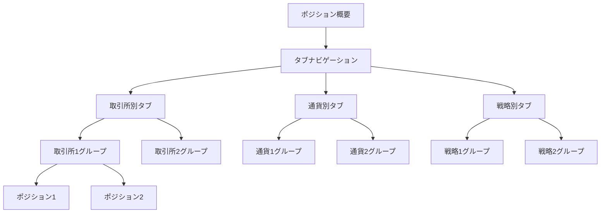

# ポジション概要改善計画

## 問題点
1. ポジション概要のページングが横に飛び出してしまう
2. ポジション概要が見づらい（取引所、通貨、戦略ごとにグループ化されていない）

## 解決策：タブ方式による改善

タブ方式を採用し、「取引所別」「通貨別」「戦略別」のタブでポジション情報を表示します。これにより、ユーザーは異なる視点からポジションを把握できるようになります。



## 実装計画

### 1. HTMLの変更
- ポジション概要セクションにBootstrapのタブナビゲーションを追加
- タブコンテンツ用のコンテナを用意
- ページネーションをレスポンシブに改善

### 2. CSSの変更
- タブコンテンツのスタイル定義
- ページネーションのスタイル改修
- グループ化表示のためのスタイル追加

### 3. JavaScriptの変更
- ポジションデータを取引所/通貨/戦略ごとにグループ化する関数を追加
- タブ切り替え処理の実装
- グループごとのポジション表示ロジックの実装

## 詳細な実装手順

1. **index.html** - ポジション概要セクションの構造を変更
   - Bootstrap tabsを使用したタブナビゲーションを追加
   - 各タブのコンテンツエリアを準備
   - ページネーションをレスポンシブに改善

2. **style.css** - スタイル調整
   - ページネーションが横に飛び出さないよう調整
   - タブ内のグループ表示用のスタイル追加
   - ポジショングループのスタイル定義

3. **dashboard.js** - 機能実装
   - ポジションデータのグループ化関数を追加
   - タブ切り替え時の表示更新処理
   - 各タブ用の表示ロジック実装

## コード実装イメージ

### HTML構造のイメージ:
```html
<div class="card-body">
  <h5 class="card-title">現在のポジション <a href="positions.html" class="btn btn-sm btn-outline-primary float-end">詳細を表示</a></h5>
  
  <!-- タブナビゲーション -->
  <ul class="nav nav-tabs" id="positionTabs" role="tablist">
    <li class="nav-item" role="presentation">
      <button class="nav-link active" id="exchange-tab" data-bs-toggle="tab" data-bs-target="#exchange-content" type="button" role="tab">取引所別</button>
    </li>
    <li class="nav-item" role="presentation">
      <button class="nav-link" id="symbol-tab" data-bs-toggle="tab" data-bs-target="#symbol-content" type="button" role="tab">通貨別</button>
    </li>
    <li class="nav-item" role="presentation">
      <button class="nav-link" id="strategy-tab" data-bs-toggle="tab" data-bs-target="#strategy-content" type="button" role="tab">戦略別</button>
    </li>
  </ul>
  
  <!-- タブコンテンツ -->
  <div class="tab-content" id="positionsTabContent">
    <div class="tab-pane fade show active" id="exchange-content" role="tabpanel">
      <!-- 取引所別ポジションがここに表示 -->
    </div>
    <div class="tab-pane fade" id="symbol-content" role="tabpanel">
      <!-- 通貨別ポジションがここに表示 -->
    </div>
    <div class="tab-pane fade" id="strategy-content" role="tabpanel">
      <!-- 戦略別ポジションがここに表示 -->
    </div>
  </div>
</div>
```

### JavaScript実装イメージ:
```javascript
/**
 * ポジションデータを取引所別にグループ化
 */
function groupPositionsByExchange(positions) {
  const groupedPositions = {};
  
  positions.forEach(position => {
    if (!groupedPositions[position.exchangeId]) {
      groupedPositions[position.exchangeId] = [];
    }
    groupedPositions[position.exchangeId].push(position);
  });
  
  return groupedPositions;
}

/**
 * ポジションデータを通貨別にグループ化
 */
function groupPositionsBySymbol(positions) {
  const groupedPositions = {};
  
  positions.forEach(position => {
    if (!groupedPositions[position.symbol]) {
      groupedPositions[position.symbol] = [];
    }
    groupedPositions[position.symbol].push(position);
  });
  
  return groupedPositions;
}

/**
 * ポジションデータを戦略別にグループ化
 */
function groupPositionsByStrategy(positions) {
  const groupedPositions = {};
  
  positions.forEach(position => {
    if (!groupedPositions[position.strategyKey]) {
      groupedPositions[position.strategyKey] = [];
    }
    groupedPositions[position.strategyKey].push(position);
  });
  
  return groupedPositions;
}

/**
 * タブ内のグループ化されたポジションを表示
 */
function displayGroupedPositions(groupedPositions, containerId) {
  const container = document.getElementById(containerId);
  let html = '';
  
  // グループごとにポジションを表示
  Object.keys(groupedPositions).forEach(groupKey => {
    const positions = groupedPositions[groupKey];
    
    html += `
      <div class="position-group mb-2">
        <div class="position-group-header" data-bs-toggle="collapse" data-bs-target="#group-${containerId}-${groupKey.replace(/[^a-zA-Z0-9]/g, '-')}">
          <h6>${groupKey} <span class="badge bg-secondary">${positions.length}</span></h6>
        </div>
        <div class="collapse show" id="group-${containerId}-${groupKey.replace(/[^a-zA-Z0-9]/g, '-')}">
    `;
    
    // グループ内の各ポジションを表示
    positions.forEach(position => {
      const isPositive = position.realizedPnL > 0;
      const cardClass = isPositive ? 'positive' : position.realizedPnL < 0 ? 'negative' : '';
      
      html += `
        <div class="position-summary ${cardClass} mb-2 p-2 border rounded">
          <div class="d-flex justify-content-between align-items-center">
            <div>
              <strong>${position.symbol}</strong>
              <small class="text-muted ms-2">${position.exchangeId} - ${position.strategyKey}</small>
            </div>
            <span class="badge ${isPositive ? 'bg-success' : position.realizedPnL < 0 ? 'bg-danger' : 'bg-secondary'}">
              ${position.realizedPnL !== null && position.realizedPnL !== undefined ? position.realizedPnL.toLocaleString() : '0'} 円
            </span>
          </div>
        </div>
      `;
    });
    
    html += `
        </div>
      </div>
    `;
  });
  
  container.innerHTML = html;
}
```

### CSSスタイルのイメージ:
```css
/* ポジショングループスタイル */
.position-group {
  border: 1px solid #e9ecef;
  border-radius: 0.25rem;
  margin-bottom: 0.5rem;
}

.position-group-header {
  padding: 0.5rem;
  background-color: #f8f9fa;
  cursor: pointer;
  border-bottom: 1px solid #e9ecef;
}

.position-group-header h6 {
  margin-bottom: 0;
  display: flex;
  justify-content: space-between;
  align-items: center;
}

/* ページネーション改善 */
#positions-pagination {
  overflow-x: auto;
  padding-bottom: 5px;
}

#positions-pagination .pagination {
  flex-wrap: nowrap;
  white-space: nowrap;
  margin-bottom: 0;
}