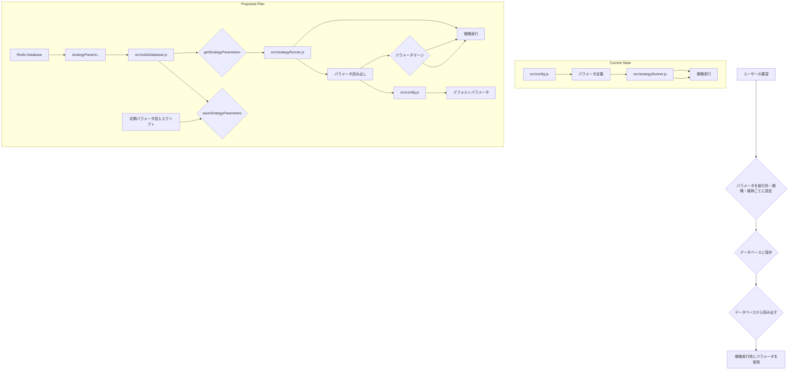

# 戦略パラメータのデータベース化計画

## 概要

戦略のパラメータを取引所、戦略、銘柄ごとに設定できるようにし、それをデータベース（Redis）から読み出すようにする。

## 目的

- 戦略パラメータの一元管理
- 取引所、戦略、銘柄ごとの柔軟なパラメータ設定
- デフォルト値からの動的なパラメータ変更（将来的な拡張）

## 計画詳細

1.  **データベーススキーマの設計**:
    -   Redis の Hash 型を使用。
    -   キーの形式: `strategyParams:<exchangeId>:<symbol>:<strategyKey>`
    -   Hash のフィールド: 各戦略固有のパラメータに加え、戦略実行に関連する共通パラメータ（`amount`, `tradePercentage` など）を格納。

2.  **データベース操作関数の追加**:
    -   `src/redisDatabase.js` に以下の関数を追加:
        -   `saveStrategyParameters(exchangeId, symbol, strategyKey, params)`: 指定された取引所、通貨ペア、戦略キーに対してパラメータを保存する。
        -   `getStrategyParameters(exchangeId, symbol, strategyKey)`: 指定された取引所、通貨ペア、戦略キーに対応するパラメータをデータベースから読み出す。データベースに存在しない場合は `src/config.js` のデフォルト値を返す。

3.  **パラメータ読み出しロジックの実装**:
    -   `src/strategyRunner.js` の `runStrategy` 関数内で、戦略設定を読み込む際に、まず `getStrategyParameters` を呼び出してデータベースからパラメータを取得する。
    -   取得したパラメータと `src/config.js` のデフォルト値をマージし、最終的なパラメータとして使用する。データベースの値が優先されるようにマージする。

4.  **初期パラメータのデータベース投入**:
    -   `scripts/` ディレクトリに、`populateStrategyParams.js` のような新規スクリプトを作成する。
    -   このスクリプトは `src/config.js` に現在定義されているパラメータを読み込み、設計したスキーマに従ってデータベースに一括で保存する。

## 計画フロー

## 次のステップ

この計画に基づき、コードの実装に進みます。