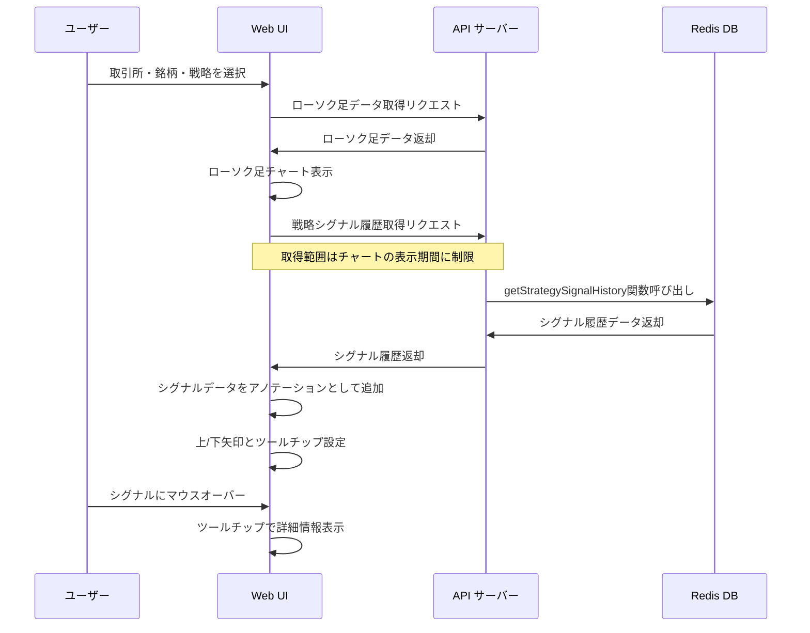

# 戦略シグナル履歴のローソク足チャートへの表示機能実装計画

## 目的

取引戦略シグナル履歴を取得し、既存のローソク足チャートに重ねて表示する機能を実装する。これにより、ユーザーは戦略のシグナルとマーケット状況を視覚的に関連付けて分析できるようになる。

## 現状の調査

### 既存の機能

1. **redisDatabase.js**:
   - `getStrategySignalHistory` 関数が既に実装されており、戦略シグナル履歴を取得できる

2. **src/api/controllers/redis-strategy-signals.js**:
   - `getStrategySignals` コントローラーが既に実装されている

3. **src/api/redis-routes.js**:
   - `/strategy-signals` エンドポイントが既に定義されている

4. **src/web/js/analysis.js**:
   - ローソク足チャートの表示機能が既に実装されている
   - 取引所、銘柄、戦略の選択機能も既に実装されている

### 必要な追加機能

1. 選択された取引所、銘柄、戦略に基づいて戦略シグナル履歴を取得する
2. 取得したシグナルデータをローソク足チャートに重ねて表示する
3. チャートの時間範囲と一致するようにシグナルデータをフィルタリングする
4. シグナルにマウスオーバーした時に詳細情報をツールチップで表示する

## データフロー図



## 実装手順

### 1. ライブラリの追加

Chart.jsのアノテーションプラグインを追加して、シグナルを効果的に表示します。

```html
<!-- src/web/analysis.html に追加 -->
<script src="https://cdn.jsdelivr.net/npm/chartjs-plugin-annotation"></script>
```

### 2. シグナルデータ取得関数の実装

```javascript
/**
 * 戦略シグナル履歴を取得する関数
 */
async function loadStrategySignals() {
  const exchange = document.getElementById('exchange-select').value;
  const symbol = document.getElementById('symbol-select').value;
  const strategy = document.getElementById('strategy-select').value;
  
  if (!exchange || !symbol) return [];
  
  // ローソク足チャートのデータ範囲を取得
  const chartTimeRange = getChartTimeRange();
  if (!chartTimeRange) return [];
  
  try {
    const params = new URLSearchParams({
      exchange,
      symbol,
      strategy,
      start_time: chartTimeRange.start,
      end_time: chartTimeRange.end
    });
    
    const res = await fetch(`/api/strategy-signals?${params.toString()}`);
    const result = await res.json();
    
    return result.data || [];
  } catch (e) {
    console.error('戦略シグナル履歴の取得に失敗しました:', e);
    return [];
  }
}

/**
 * チャートの時間範囲を取得する関数
 */
function getChartTimeRange() {
  if (!window.ohlcChart || !window.ohlcChart.data.datasets[0].data.length) {
    return null;
  }
  
  const ohlcData = window.ohlcChart.data.datasets[0].data;
  const start = Math.min(...ohlcData.map(d => d.x));
  const end = Math.max(...ohlcData.map(d => d.x));
  
  return { start, end };
}
```

### 3. シグナル表示機能の実装

```javascript
/**
 * ローソク足チャートに戦略シグナルを表示する関数
 * @param {Array} signalData - シグナルデータ
 */
function addSignalsToChart(signalData) {
  if (!window.ohlcChart || !signalData || signalData.length === 0) return;
  
  // 既存のアノテーションを削除する
  if (window.ohlcChart.options.plugins.annotation) {
    window.ohlcChart.options.plugins.annotation.annotations = {};
  } else {
    window.ohlcChart.options.plugins.annotation = {
      annotations: {}
    };
  }
  
  // 新しいアノテーションを追加
  const annotations = {};
  
  signalData.forEach((signal, index) => {
    const id = `signal-${index}`;
    annotations[id] = createSignalAnnotation(signal);
  });
  
  window.ohlcChart.options.plugins.annotation.annotations = annotations;
  window.ohlcChart.update();
}

/**
 * シグナルデータからアノテーションオブジェクトを作成する
 * @param {Object} signal - シグナルデータ
 * @returns {Object} - Chart.jsアノテーションオブジェクト
 */
function createSignalAnnotation(signal) {
  // シグナルタイプに基づいてデザインを決定
  const isBuy = signal.signalType === 'buy';
  const color = isBuy ? 'rgba(40, 167, 69, 1)' : 'rgba(220, 53, 69, 1)';
  const pointStyle = isBuy ? 'triangle' : 'triangle-down';
  
  // プライスポイントを取得（ローソク足の上または下に配置）
  const yAdjust = isBuy ? 10 : -10; // 買いは上に、売りは下に表示
  
  return {
    type: 'point',
    xValue: signal.timestamp,
    yValue: signal.price,
    backgroundColor: color,
    borderColor: 'white',
    borderWidth: 2,
    radius: 8,
    pointStyle: pointStyle,
    yAdjust: yAdjust,
    
    // ツールチップの設定
    tooltip: {
      enabled: true,
      callbacks: {
        title: function() {
          return `${isBuy ? '買い' : '売り'}シグナル`;
        },
        label: function() {
          const date = new Date(signal.timestamp).toLocaleString('ja-JP');
          return [
            `時間: ${date}`,
            `価格: ${signal.price}`,
            `戦略: ${signal.strategyKey}`
          ];
        }
      }
    }
  };
}
```

### 4. 既存関数の拡張

```javascript
/**
 * ローソク足チャートを更新する関数（拡張版）
 */
function updateOhlcChart(ohlcvData) {
  try {
    // チャートが存在する場合は必ず破棄
    if (window.ohlcChart instanceof Chart) {
      window.ohlcChart.destroy();
      window.ohlcChart = null;
    }

    // ...（既存のコード）

    // 新しいチャートを作成
    window.ohlcChart = new Chart(ctx, {
      type: 'candlestick',
      data: {
        datasets: [{
          label: 'ローソク足',
          data: ohlcvData,
          color: {
            up: '#26a69a', down: '#ef5350', unchanged: '#ccc'
          }
        }]
      },
      options: chartOptions
    });
    
    // チャート作成後に戦略シグナルを取得して表示
    loadStrategySignals().then(signals => {
      addSignalsToChart(signals);
    });
  } catch (error) {
    // ...（既存のエラー処理コード）
  }
}

/**
 * 戦略変更時のハンドラ（拡張版）
 */
function handleStrategyChange() {
  // ローソク足データを再読み込み（シグナル表示も更新される）
  loadOhlcvData();
}
```

## 実装上の考慮事項

### 1. パフォーマンス最適化

- ローソク足チャートのデータ範囲に合わせて、必要なシグナルデータのみを取得
- 大量のシグナルがある場合は、表示を間引くなどのパフォーマンス対策も検討
- 余分なAPI呼び出しを避けるために、関連するパラメータ変更時のみデータを再取得

### 2. ユーザビリティ

- 買いシグナルは上向き矢印、売りシグナルは下向き矢印で視覚的に区別
- 矢印のサイズや色は、ローソク足との視認性を考慮して調整
- シグナルにマウスオーバーした際にツールチップで詳細情報（時間、価格、戦略情報）を表示

### 3. エラーハンドリング

- シグナルデータの取得に失敗した場合でもチャート表示を継続
- エラーメッセージを適切に表示し、ユーザー体験を損なわないようにする
- データロード中は適切なローディングインジケータを表示

## 今後の拡張可能性

1. シグナル表示のON/OFFを切り替えるチェックボックスの追加
2. 複数の戦略シグナルを同時に表示する機能の追加
3. シグナルの種類によってカスタマイズ可能な表示設定（色、形状など）
4. シグナルのパフォーマンス評価機能（シグナル後の価格変動分析など）

## 結論

この実装により、トレーダーは戦略から生成されたシグナルとマーケット状況を同じチャート上で視覚的に分析できるようになり、戦略の効果や改善点を把握しやすくなります。実装はChart.jsのアノテーションプラグインを活用することで、既存のローソク足チャート機能と自然に統合されます。