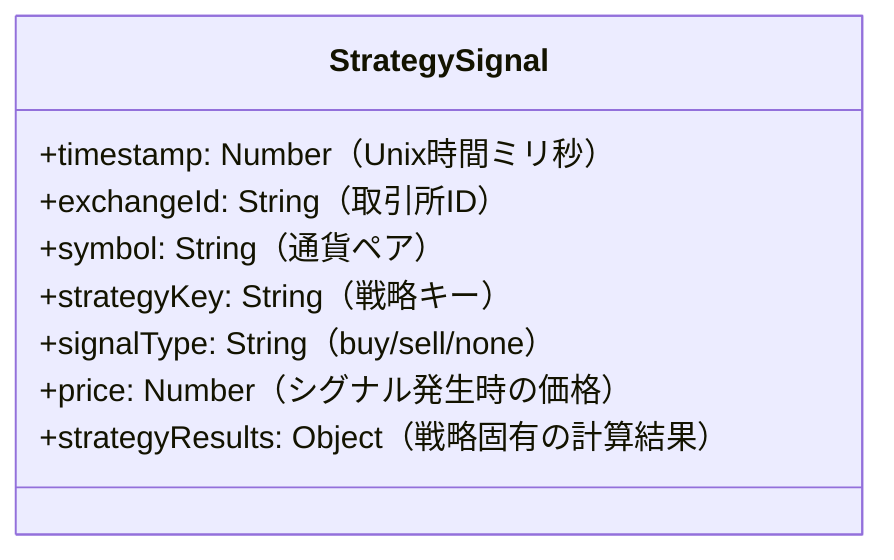

# 戦略シグナル履歴保存機能の実装計画

## 概要

各取引戦略が生成するシグナル（買い・売り・シグナルなし）を履歴としてRedisデータベースに保存し、後から時間順でソートしたり、特定の時間枠で検索できるようにする機能を実装します。

## データモデル



各戦略のstrategyResultsの例：
- MA戦略: `{ shortMA: 数値, longMA: 数値 }`
- MACD戦略: `{ macd: 数値, signal: 数値, histogram: 数値 }`
- RSI戦略: `{ rsi: 数値 }`
- ボリンジャーバンド戦略: `{ upper: 数値, middle: 数値, lower: 数値, bandwidth: 数値 }`

## Redis実装詳細

### データ保存構造

1. **シグナル履歴**:
   - キー: `strategy:signalHistory:{exchangeId}:{symbol}:{strategyKey}`
   - 型: Redis List
   - 値: シグナル情報のJSON文字列

2. **時系列インデックス**:
   - キー: `strategy:signalHistory:time`
   - 型: Redis Sorted Set
   - スコア: タイムスタンプ
   - 値: `{exchangeId}:{symbol}:{strategyKey}:{timestamp}`

3. **日次シグナルカウンタ**:
   - キー: `strategy:signalCount:{YYYY-MM-DD}`
   - 型: Redis Hash
   - フィールド: `{exchangeId}:{symbol}:{strategyKey}`
   - 値: 該当日のシグナル数

4. **履歴データのTTL（Time-To-Live）**:
   - 個別のデータリストやインデックスにTTLを設定し、自動的に古いデータを削除

## パフォーマンス最適化戦略

### 1. データの時間範囲分割

データを時間範囲ごとに分割して保存することで、検索効率を向上させます。

```
strategy:signalHistory:{exchangeId}:{symbol}:{strategyKey}:{YYYY-MM-DD}
```

この形式では、特定の日付のデータだけを取得することができ、大量のデータがある場合でも必要な部分だけを効率的に検索できます。

### 2. データのTTLとアーカイブ戦略

1. **最新データの保持**:
   - 例えば、直近30日分のデータは完全な形式で保持（すべての計算結果を含む）
   - キーに適切なTTLを設定: `EXPIRE strategy:signalHistory:{exchangeId}:{symbol}:{strategyKey}:{YYYY-MM-DD} 2592000` (30日)

2. **古いデータの圧縮**:
   - 30日以上経過したデータは、重要な情報のみを残して圧縮形式で保存
   - 例: 詳細な計算結果は省略し、タイムスタンプ、シグナルタイプ、価格のみ保持

3. **長期アーカイブ**:
   - 1年以上古いデータは別のストレージ（例：TimescaleDBやAWS S3など）にアーカイブ
   - 必要に応じて専用のAPIで取得できるようにする

### 3. インデックスの最適化

1. **複合インデックス**:
   - よく使われる検索パターンに基づいて複合インデックスを作成
   - 例: `strategy:signalHistory:index:{exchangeId}:{strategyKey}:time`

2. **部分インデックス**:
   - 必要に応じて、重要なシグナル（例：買いや売りシグナル）のみのインデックスも作成
   - 例: `strategy:signalHistory:buySignals:time`

### 4. カウンタとサマリーデータ

頻繁に必要になる統計情報を事前に計算しておき、全データをスキャンせずに取得できるようにします。

1. **日次シグナル集計**:
   - 日毎のシグナル数などの統計情報を別途保存
   - 例: `strategy:signalStats:{YYYY-MM-DD}:{exchangeId}:{symbol}:{strategyKey}`

2. **シグナル効果追跡**:
   - シグナル後の価格変動を追跡し、シグナルの有効性を評価
   - 例: `strategy:signalEffectiveness:{exchangeId}:{symbol}:{strategyKey}:{timeframe}`

## 実装コード

### redisDatabase.js に追加する関数

```javascript
/**
 * 戦略シグナルを記録する関数
 * @param {String} exchangeId - 取引所ID
 * @param {String} symbol - 通貨ペア
 * @param {String} strategyKey - 戦略キー
 * @param {String} signalType - シグナル種別 (buy/sell/none)
 * @param {Number} price - 現在価格
 * @param {Object} strategyResults - 戦略固有の計算結果
 * @returns {Promise} 処理完了時に解決されるPromise
 */
async function addStrategySignal(exchangeId, symbol, strategyKey, signalType, price, strategyResults = {}) {
  const now = Date.now();
  const dateKey = new Date(now).toISOString().split('T')[0]; // YYYY-MM-DD形式
  
  // インデックスセットに追加
  await client.sAdd('exchanges', exchangeId);
  await client.sAdd(`symbols:${exchangeId}`, symbol);
  await client.sAdd(`strategies:${exchangeId}:${symbol}`, strategyKey);
  
  // シグナル履歴キー（日付別）
  const signalHistoryKey = `strategy:signalHistory:${exchangeId}:${symbol}:${strategyKey}:${dateKey}`;
  
  // シグナルデータをJSONに変換
  const signalData = JSON.stringify({
    timestamp: now,
    signalType,
    price,
    strategyResults
  });
  
  // シグナル履歴を追加
  await client.rPush(signalHistoryKey, signalData);
  
  // 30日間のTTLを設定（必要に応じて調整）
  await client.expire(signalHistoryKey, 30 * 24 * 60 * 60); // 30日
  
  // 時系列インデックスに追加
  await client.zAdd(`strategy:signalHistory:time:${dateKey}`, {
    score: now,
    value: `${exchangeId}:${symbol}:${strategyKey}:${now}`
  });
  
  // インデックスにもTTLを設定
  await client.expire(`strategy:signalHistory:time:${dateKey}`, 30 * 24 * 60 * 60); // 30日
  
  // 日次カウンタを更新
  await client.hIncrBy(`strategy:signalCount:${dateKey}`, `${exchangeId}:${symbol}:${strategyKey}`, 1);
  await client.expire(`strategy:signalCount:${dateKey}`, 90 * 24 * 60 * 60); // 90日
  
  // シグナルタイプ別インデックス（買い・売りの場合のみ）
  if (signalType !== 'none') {
    await client.zAdd(`strategy:${signalType}Signals:time:${dateKey}`, {
      score: now,
      value: `${exchangeId}:${symbol}:${strategyKey}:${now}`
    });
    await client.expire(`strategy:${signalType}Signals:time:${dateKey}`, 30 * 24 * 60 * 60); // 30日
  }
  
  // イベントを発火（UIなどに通知するため）
  const event = {
    type: 'strategy_signal_added',
    data: {
      exchangeId,
      symbol,
      strategyKey,
      signalType,
      price,
      timestamp: now,
      strategyResults
    }
  };
  
  // イベントをRedisに発行
  await client.publish('trade_events', JSON.stringify(event));
  
  return true;
}

/**
 * 戦略シグナル履歴を取得する関数
 * @param {Object} filters - フィルター条件
 * @param {Number} limit - 取得件数
 * @param {Number} offset - オフセット
 * @returns {Promise<Object>} 戦略シグナル履歴と合計件数
 */
async function getStrategySignalHistory(filters = {}, limit = 100, offset = 0) {
  const { exchangeId, symbol, strategyKey, startDate, endDate, signalType } = filters;
  
  let signalItems = [];
  let allSignals = []; // 全データを保持する変数
  
  // 日付範囲を決定
  const now = Date.now();
  const endDateTime = endDate ? new Date(endDate) : new Date(now);
  const startDateTime = startDate ? new Date(startDate) : new Date(now - 7 * 24 * 60 * 60 * 1000); // デフォルト1週間
  
  // 日付の配列を作成（YYYY-MM-DD形式）
  const dates = [];
  const currentDate = new Date(startDateTime);
  while (currentDate <= endDateTime) {
    dates.push(currentDate.toISOString().split('T')[0]);
    currentDate.setDate(currentDate.getDate() + 1);
  }
  
  // 特定の取引所、通貨ペア、戦略が指定されている場合
  if (exchangeId && symbol && strategyKey) {
    // 各日付のデータを取得
    for (const dateKey of dates) {
      const signalHistoryKey = `strategy:signalHistory:${exchangeId}:${symbol}:${strategyKey}:${dateKey}`;
      
      // キーが存在するか確認
      const exists = await client.exists(signalHistoryKey);
      if (!exists) continue;
      
      // データを取得
      const data = await client.lRange(signalHistoryKey, 0, -1);
      
      // パースしてフィルタリング
      for (const item of data) {
        const signal = JSON.parse(item);
        
        // タイムスタンプフィルタリング
        if (startDate && signal.timestamp < startDate) continue;
        if (endDate && signal.timestamp > endDate) continue;
        
        // シグナルタイプフィルタリング
        if (signalType && signal.signalType !== signalType) continue;
        
        allSignals.push({
          timestamp: Number(signal.timestamp),
          exchangeId,
          symbol,
          strategyKey,
          signalType: signal.signalType,
          price: signal.price,
          strategyResults: signal.strategyResults
        });
      }
    }
  } else {
    // シグナルタイプが指定されている場合、専用インデックスを使用
    const indexKeyPrefix = signalType ? `strategy:${signalType}Signals:time:` : 'strategy:signalHistory:time:';
    
    // 各日付のインデックスを使用
    for (const dateKey of dates) {
      const indexKey = `${indexKeyPrefix}${dateKey}`;
      
      // キーが存在するか確認
      const exists = await client.exists(indexKey);
      if (!exists) continue;
      
      // スコア範囲を設定
      let scoreMin = '-inf';
      let scoreMax = '+inf';
      
      if (startDate) {
        scoreMin = Math.max(startDate, new Date(`${dateKey}T00:00:00Z`).getTime());
      }
      
      if (endDate) {
        scoreMax = Math.min(endDate, new Date(`${dateKey}T23:59:59Z`).getTime());
      }
      
      // インデックスからアイテムを取得
      const indexItems = await client.zRangeByScore(indexKey, scoreMin, scoreMax);
      
      // 各アイテムを処理
      for (const item of indexItems) {
        const [itemExchangeId, itemSymbol, itemStrategyKey, timestamp] = item.split(':');
        
        // フィルター条件に一致するか確認
        if (exchangeId && itemExchangeId !== exchangeId) continue;
        if (symbol && itemSymbol !== symbol) continue;
        if (strategyKey && itemStrategyKey !== strategyKey) continue;
        
        // 履歴キーを構築
        const signalHistoryKey = `strategy:signalHistory:${itemExchangeId}:${itemSymbol}:${itemStrategyKey}:${dateKey}`;
        
        // データを取得して検索
        const historyData = await client.lRange(signalHistoryKey, 0, -1);
        
        for (const historyItem of historyData) {
          const signal = JSON.parse(historyItem);
          
          // タイムスタンプが一致するものを探す
          if (signal.timestamp.toString() === timestamp) {
            // シグナルタイプフィルタリング（インデックスを使用しない場合）
            if (signalType && signal.signalType !== signalType) continue;
            
            allSignals.push({
              timestamp: Number(signal.timestamp),
              exchangeId: itemExchangeId,
              symbol: itemSymbol,
              strategyKey: itemStrategyKey,
              signalType: signal.signalType,
              price: signal.price,
              strategyResults: signal.strategyResults
            });
            break;
          }
        }
      }
    }
  }
  
  // 降順（新しい順）にソート
  allSignals.sort((a, b) => b.timestamp - a.timestamp);
  
  // ページングを適用
  signalItems = allSignals.slice(offset, offset + limit);
  
  return {
    count: allSignals.length,
    data: signalItems
  };
}

/**
 * シグナル数の統計情報を取得する関数
 * @param {String} startDate - 開始日 (YYYY-MM-DD)
 * @param {String} endDate - 終了日 (YYYY-MM-DD)
 * @param {Object} filters - フィルター条件
 * @returns {Promise<Object>} 統計情報
 */
async function getSignalStatistics(startDate, endDate, filters = {}) {
  const { exchangeId, symbol, strategyKey } = filters;
  
  // 日付範囲を決定
  const now = new Date();
  const endDateTime = endDate ? new Date(endDate) : new Date(now);
  const startDateTime = startDate ? new Date(startDate) : new Date(now);
  startDateTime.setDate(startDateTime.getDate() - 7); // デフォルト1週間
  
  // 日付の配列を作成（YYYY-MM-DD形式）
  const dates = [];
  const currentDate = new Date(startDateTime);
  while (currentDate <= endDateTime) {
    dates.push(currentDate.toISOString().split('T')[0]);
    currentDate.setDate(currentDate.getDate() + 1);
  }
  
  // 統計結果オブジェクト
  const stats = {
    totalSignals: 0,
    buySignals: 0,
    sellSignals: 0,
    noSignals: 0,
    dailyBreakdown: {},
    strategyBreakdown: {}
  };
  
  // 各日付のデータを処理
  for (const dateKey of dates) {
    // その日の集計を初期化
    stats.dailyBreakdown[dateKey] = {
      total: 0,
      buy: 0,
      sell: 0,
      none: 0
    };
    
    // カウンタキー
    const countKey = `strategy:signalCount:${dateKey}`;
    
    // キーが存在するか確認
    const exists = await client.exists(countKey);
    if (!exists) continue;
    
    // カウンタデータを取得
    const counters = await client.hGetAll(countKey);
    
    // カウンタを処理
    for (const [key, count] of Object.entries(counters)) {
      const [itemExchangeId, itemSymbol, itemStrategyKey] = key.split(':');
      
      // フィルター条件に一致するか確認
      if (exchangeId && itemExchangeId !== exchangeId) continue;
      if (symbol && itemSymbol !== symbol) continue;
      if (strategyKey && itemStrategyKey !== strategyKey) continue;
      
      // 数値に変換
      const numCount = parseInt(count);
      
      // 集計に追加
      stats.totalSignals += numCount;
      stats.dailyBreakdown[dateKey].total += numCount;
      
      // 戦略別の集計
      if (!stats.strategyBreakdown[itemStrategyKey]) {
        stats.strategyBreakdown[itemStrategyKey] = {
          total: 0,
          byExchange: {}
        };
      }
      
      stats.strategyBreakdown[itemStrategyKey].total += numCount;
      
      // 取引所別の集計
      if (!stats.strategyBreakdown[itemStrategyKey].byExchange[itemExchangeId]) {
        stats.strategyBreakdown[itemStrategyKey].byExchange[itemExchangeId] = 0;
      }
      
      stats.strategyBreakdown[itemStrategyKey].byExchange[itemExchangeId] += numCount;
    }
    
    // その日のシグナルタイプ別カウントを計算
    // 買いシグナル
    const buyKey = `strategy:buySignals:time:${dateKey}`;
    if (await client.exists(buyKey)) {
      const buyCount = await client.zCount(buyKey, '-inf', '+inf');
      stats.buySignals += buyCount;
      stats.dailyBreakdown[dateKey].buy = buyCount;
    }
    
    // 売りシグナル
    const sellKey = `strategy:sellSignals:time:${dateKey}`;
    if (await client.exists(sellKey)) {
      const sellCount = await client.zCount(sellKey, '-inf', '+inf');
      stats.sellSignals += sellCount;
      stats.dailyBreakdown[dateKey].sell = sellCount;
    }
    
    // シグナルなしは合計から買いと売りを引いて計算
    stats.dailyBreakdown[dateKey].none = stats.dailyBreakdown[dateKey].total - 
                                          stats.dailyBreakdown[dateKey].buy - 
                                          stats.dailyBreakdown[dateKey].sell;
    stats.noSignals += stats.dailyBreakdown[dateKey].none;
  }
  
  return stats;
}

/**
 * 古いシグナルデータをアーカイブするクリーンアップ関数
 * 30日より古いデータを集約・圧縮し、アーカイブ用のストレージに移動
 * （実際のアーカイブ処理は外部システム連携が必要なため概略のみ）
 */
async function archiveOldSignalData() {
  const now = Date.now();
  const archiveDate = new Date(now - 30 * 24 * 60 * 60 * 1000); // 30日前
  const archiveDateStr = archiveDate.toISOString().split('T')[0];
  
  // すべての取引所を取得
  const exchanges = await client.sMembers('exchanges');
  
  for (const exchangeId of exchanges) {
    // すべての通貨ペアを取得
    const symbols = await client.sMembers(`symbols:${exchangeId}`);
    
    for (const symbol of symbols) {
      // すべての戦略を取得
      const strategies = await client.sMembers(`strategies:${exchangeId}:${symbol}`);
      
      for (const strategyKey of strategies) {
        // アーカイブ対象の日付のキーを検索
        const pattern = `strategy:signalHistory:${exchangeId}:${symbol}:${strategyKey}:*`;
        const keys = await client.keys(pattern);
        
        for (const key of keys) {
          // キーから日付部分を抽出
          const keyParts = key.split(':');
          const dateStr = keyParts[keyParts.length - 1];
          
          // 日付をチェック（YYYY-MM-DD形式を想定）
          if (dateStr < archiveDateStr) {
            // 圧縮データを取得
            const data = await client.lRange(key, 0, -1);
            
            // 必要に応じてここでデータ圧縮・集約処理を実装
            // 例：詳細な計算結果を省略し、基本情報のみ保持
            
            // アーカイブ処理（実際の実装はストレージシステムに依存）
            // 例：S3に保存、外部DBに移行など
            
            // アーカイブ完了後、Redisから削除
            await client.del(key);
            
            // 関連するインデックスも削除
            const timeIndexKey = `strategy:signalHistory:time:${dateStr}`;
            if (await client.exists(timeIndexKey)) {
              await client.del(timeIndexKey);
            }
            
            // シグナルタイプ別インデックスも削除
            for (const type of ['buy', 'sell']) {
              const signalTypeIndexKey = `strategy:${type}Signals:time:${dateStr}`;
              if (await client.exists(signalTypeIndexKey)) {
                await client.del(signalTypeIndexKey);
              }
            }
          }
        }
      }
    }
  }
  
  console.log(`古いシグナルデータのアーカイブが完了しました: ${archiveDateStr}より前のデータ`);
}
```

### APIコントローラーの実装

```javascript
/**
 * 戦略シグナル履歴コントローラー
 */
const { 
  getStrategySignalHistory, 
  getSignalStatistics 
} = require('../../redisDatabase');

/**
 * 戦略シグナル履歴を取得するAPI
 */
async function getStrategySignals(req, res) {
  try {
    const { 
      exchange, 
      symbol, 
      strategy, 
      start_time, 
      end_time, 
      signal_type,
      limit = 100, 
      offset = 0 
    } = req.query;
    
    // フィルターの作成
    const filters = {};
    if (exchange) filters.exchangeId = exchange;
    if (symbol) filters.symbol = symbol;
    if (strategy) filters.strategyKey = strategy;
    if (signal_type) filters.signalType = signal_type;
    
    // 時間範囲の設定
    if (start_time) {
      // Unix時間（ミリ秒）かISO文字列かを自動判別
      filters.startDate = !isNaN(start_time) ? 
        parseInt(start_time) : 
        new Date(start_time).getTime();
    }
    
    if (end_time) {
      // Unix時間（ミリ秒）かISO文字列かを自動判別
      filters.endDate = !isNaN(end_time) ? 
        parseInt(end_time) : 
        new Date(end_time).getTime();
    }
    
    // 戦略シグナル履歴を取得
    const result = await getStrategySignalHistory(
      filters, 
      parseInt(limit), 
      parseInt(offset)
    );
    
    // 応答を返す
    res.json(result);
  } catch (error) {
    console.error('戦略シグナル履歴API処理中にエラーが発生しました:', error);
    res.status(500).json({ error: error.message });
  }
}

/**
 * シグナル統計情報を取得するAPI
 */
async function getSignalStats(req, res) {
  try {
    const { 
      exchange, 
      symbol, 
      strategy, 
      start_date, 
      end_date 
    } = req.query;
    
    // フィルターの作成
    const filters = {};
    if (exchange) filters.exchangeId = exchange;
    if (symbol) filters.symbol = symbol;
    if (strategy) filters.strategyKey = strategy;
    
    // 統計情報を取得
    const result = await getSignalStatistics(
      start_date, 
      end_date, 
      filters
    );
    
    // 応答を返す
    res.json(result);
  } catch (error) {
    console.error('シグナル統計情報API処理中にエラーが発生しました:', error);
    res.status(500).json({ error: error.message });
  }
}

module.exports = {
  getStrategySignals,
  getSignalStats
};
```

## APIルートの拡張

```javascript
// シグナル関連のコントローラーをインポート
const { 
  getStrategySignals, 
  getSignalStats 
} = require('./controllers/redis-strategy-signals');

// 戦略シグナル履歴API
router.get('/strategy-signals', getStrategySignals);

// シグナル統計情報API
router.get('/strategy-signal-stats', getSignalStats);
```

## 定期的なメンテナンスタスク

データのアーカイブやクリーンアップを自動的に行うための定期的なタスクを設定します。

```javascript
// src/scheduledTasks.js
const cron = require('node-cron');
const { archiveOldSignalData } = require('./redisDatabase');

// 毎日午前3時にアーカイブ処理を実行
cron.schedule('0 3 * * *', async () => {
  console.log('古いシグナルデータのアーカイブ処理を開始します...');
  try {
    await archiveOldSignalData();
    console.log('アーカイブ処理が完了しました');
  } catch (error) {
    console.error('アーカイブ処理中にエラーが発生しました:', error);
  }
});
```

## 実装ステップ

1. **redisDatabase.js の拡張**:
   - `addStrategySignal` 関数を実装（日付別保存とTTL設定）
   - `getStrategySignalHistory` 関数を実装（日付範囲とインデックス活用）
   - `getSignalStatistics` 関数を実装（集計と統計情報）
   - `archiveOldSignalData` 関数を実装（データのアーカイブと削除）

2. **戦略関数の修正**:
   - 各戦略関数を修正して、シグナル保存機能を追加
   - 戦略固有の計算結果を構造化して返すように修正

3. **API実装**:
   - シグナル履歴取得API
   - シグナル統計情報API

4. **定期メンテナンス設定**:
   - cronジョブの設定
   - アーカイブ処理の実装

5. **モニタリングとアラート**:
   - データサイズのモニタリング
   - パフォーマンス低下時のアラート設定

## パフォーマンステスト計画

実装後、以下のシナリオでパフォーマンステストを実施します。

1. **大量データ取得テスト**:
   - 1ヶ月分（約30万シグナル）のデータ取得
   - 様々なフィルター条件での検索パフォーマンス測定

2. **高頻度書き込みテスト**:
   - 1秒間に100シグナル以上の書き込み
   - 同時読み取り/書き込み操作の影響

3. **長期運用シミュレーション**:
   - 1年分のデータが蓄積した場合のパフォーマンス
   - アーカイブと削除処理の検証

## まとめ

この実装計画では、戦略シグナルを効率的に保存し、検索できるようにするための詳細な設計を提供しています。以下の点に特に注意を払っています：

1. **スケーラビリティ**：データを日付ごとに分割し、効率的なインデックスを使用
2. **パフォーマンス**：よく使われる検索パターンに最適化されたデータ構造
3. **データライフサイクル管理**：古いデータの自動アーカイブと削除
4. **柔軟な検索オプション**：時間範囲、シグナルタイプ、戦略別などの多様なフィルタリング

これにより、長期間の運用でも高いパフォーマンスを維持しながら、シグナル履歴データを効果的に管理できます。