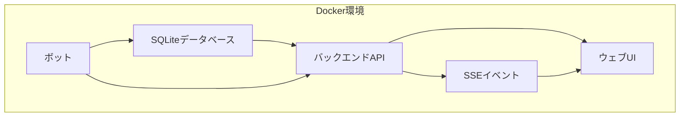

# 取引データ閲覧用ウェブUI実装計画（統合版）

## 目次
1. [プロジェクト概要](#1-プロジェクト概要)
2. [現状分析](#2-現状分析)
3. [アーキテクチャ設計](#3-アーキテクチャ設計)
4. [バックエンドAPI詳細設計](#4-バックエンドapi詳細設計)
5. [フロントエンド詳細設計](#5-フロントエンド詳細設計)
6. [リアルタイム更新機能](#6-リアルタイム更新機能)
7. [Docker設定](#7-docker設定)
8. [実装スケジュール](#8-実装スケジュール)
9. [セキュリティおよびパフォーマンス考慮事項](#9-セキュリティおよびパフォーマンス考慮事項)

---

## 1. プロジェクト概要

取引ボットシステムのデータベースから情報を読み取り、現在の取引状態や過去の取引履歴を閲覧するためのウェブUIを作成します。このUIはDocker環境でコンテナ化され、既存のアプリケーションと統合されます。

**要件:**
- シンプルなHTML/CSS/JavaScriptでの実装
- 過去の取引履歴も含めたグラフやテーブル表示
- リアルタイム更新機能
- docker-composeでの起動

---

## 2. 現状分析

### 2.1 データベース構造
- SQLiteデータベース（`data/trade_records.db`）
- `trade_records`テーブル: 各取引ペアごとの集計情報
- `trade_history`テーブル: 個別の取引履歴

### 2.2 アプリケーション構成
- Node.jsベースのトレーディングボット
- `better-sqlite3`を使用したデータ管理
- 複数のボットサービス（bot, hft, mm）がDockerで実行中

---

## 3. アーキテクチャ設計

### 3.1 全体アーキテクチャ



### 3.2 コンポーネント構成

1. **バックエンドAPI（Node.js + Express）**
   - データベースからデータを取得・加工するREST API
   - SSE（Server-Sent Events）によるリアルタイム更新機能
   - SQLiteデータベースとの接続

2. **フロントエンド（HTML/CSS/JavaScript）**
   - シンプルなSPA（Single Page Application）
   - Chart.jsによるグラフ表示
   - DataTablesによるテーブル表示
   - リアルタイム更新のためのEventSource API

### 3.3 フォルダ構造

```
harvest3/
│
├── src/
│   ├── api/                 # 新規: API関連コード
│   │   ├── index.js         # APIメインエントリーポイント
│   │   ├── routes.js        # ルート定義
│   │   └── controllers/     # APIコントローラー
│   │       ├── positions.js # ポジション情報取得
│   │       ├── history.js   # 取引履歴取得
│   │       ├── summary.js   # 集計情報取得
│   │       └── events.js    # SSEイベント管理
│   │
│   ├── web/                 # 新規: ウェブUI関連ファイル
│   │   ├── index.html       # ダッシュボードページ
│   │   ├── history.html     # 取引履歴ページ
│   │   ├── analysis.html    # 分析ページ
│   │   ├── css/             # スタイルシート
│   │   ├── js/              # フロントエンド JavaScript
│   │   │   ├── dashboard.js # ダッシュボード処理
│   │   │   ├── history.js   # 取引履歴処理
│   │   │   ├── analysis.js  # 分析グラフ処理
│   │   │   └── realtime.js  # リアルタイム更新処理
│   │   └── assets/          # 画像やフォントなどのアセット
│   │
│   └── [既存ファイル]        # 既存のソースファイル
│
├── WebUI.Dockerfile         # 新規: ウェブUI用Dockerfile
├── docker-compose.yml       # 更新: ウェブUIサービス追加
└── [その他既存ファイル]
```

---

## 4. バックエンドAPI詳細設計

### 4.1 依存パッケージ
```json
{
  "dependencies": {
    "express": "^4.18.2",
    "cors": "^2.8.5",
    "better-sqlite3": "^11.9.1",
    "morgan": "^1.10.0"
  }
}
```

### 4.2 APIエンドポイント詳細

#### 4.2.1 ポジション情報取得API
- **エンドポイント**: `GET /api/positions`
- **パラメータ**:
  - `exchangeId`: 取引所ID（オプション）
  - `symbol`: 通貨ペア（オプション）
  - `strategyKey`: 戦略キー（オプション）
- **レスポンス例**:
```json
{
  "positions": [
    {
      "exchangeId": "bitbank",
      "symbol": "BTC/JPY",
      "strategyKey": "trendFollowing",
      "buyAmount": 0.1,
      "sellAmount": 0.05,
      "netPosition": 0.05,
      "averageBuyPrice": 6000000,
      "averageSellPrice": 6200000,
      "unrealizedPnL": 10000,
      "realizedPnL": 5000
    }
  ]
}
```

#### 4.2.2 取引履歴取得API
- **エンドポイント**: `GET /api/history`
- **パラメータ**:
  - `exchangeId`: 取引所ID (オプション)
  - `symbol`: 通貨ペア (オプション)
  - `strategyKey`: 戦略キー (オプション)
  - `startDate`: 開始日時 (オプション)
  - `endDate`: 終了日時 (オプション)
  - `limit`: 取得件数 (デフォルト: 100)
  - `offset`: オフセット (デフォルト: 0)
- **レスポンス例**:
```json
{
  "history": [
    {
      "id": 123,
      "timestamp": 1680000000000,
      "exchangeId": "bitbank",
      "symbol": "BTC/JPY",
      "strategyKey": "trendFollowing",
      "side": "buy",
      "amount": 0.01,
      "price": 6000000,
      "value": 60000
    }
  ],
  "total": 156
}
```

#### 4.2.3 集計サマリーAPI
- **エンドポイント**: `GET /api/summary`
- **パラメータ**:
  - `period`: 期間 (daily, weekly, monthly, yearly, all) (デフォルト: all)
- **レスポンス例**:
```json
{
  "summary": {
    "totalBuyAmount": 1.5,
    "totalSellAmount": 1.3,
    "totalBuyCost": 9000000,
    "totalSellValue": 9500000,
    "realizedPnL": 500000,
    "currentPositions": 0.2,
    "currentPositionValue": 1200000
  },
  "byExchange": {
    "bitbank": {
      "totalBuyAmount": 1.0,
      "totalSellAmount": 0.9,
      "realizedPnL": 350000
    },
    "bitflyer": {
      "totalBuyAmount": 0.5,
      "totalSellAmount": 0.4,
      "realizedPnL": 150000
    }
  },
  "byStrategy": {
    "trendFollowing": {
      "totalBuyAmount": 1.0,
      "totalSellAmount": 0.8,
      "realizedPnL": 300000
    },
    "arbitrage": {
      "totalBuyAmount": 0.5,
      "totalSellAmount": 0.5,
      "realizedPnL": 200000
    }
  }
}
```

#### 4.2.4 リアルタイムイベントAPI
- **エンドポイント**: `GET /api/events`
- **機能**: SSEを使用したリアルタイムイベント配信
- **イベントタイプ**:
  - `trade_added`: 新規取引が追加された
  - `batch_update`: 複数の更新をまとめて配信
  - `ping`: 接続維持用の空イベント

### 4.3 API実装ファイル

#### 4.3.1 src/api/index.js
```javascript
const express = require('express');
const cors = require('cors');
const morgan = require('morgan');
const routes = require('./routes');
const { addEventListner } = require('../database');
const { sendEventToAll } = require('./controllers/events');

// APIサーバーセットアップ
const app = express();
const PORT = process.env.PORT || 3000;

// ミドルウェア
app.use(cors());
app.use(express.json());
app.use(morgan('dev'));

// 静的ファイル提供
app.use(express.static('src/web'));

// APIルート
app.use('/api', routes);

// トレード更新イベントをSSEで通知
addEventListner((event) => {
  sendEventToAll(event);
});

// サーバー起動
app.listen(PORT, () => {
  console.log(`API Server running on port ${PORT}`);
});

module.exports = app;
```

#### 4.3.2 src/api/routes.js
```javascript
const express = require('express');
const router = express.Router();
const positionsController = require('./controllers/positions');
const historyController = require('./controllers/history');
const summaryController = require('./controllers/summary');
const eventsController = require('./controllers/events');

// 各種ルート定義
router.get('/positions', positionsController.getPositions);
router.get('/history', historyController.getHistory);
router.get('/summary', summaryController.getSummary);
router.get('/events', eventsController.eventsHandler);

module.exports = router;
```

#### 4.3.3 src/api/controllers/events.js
```javascript
const { getTradeRecordsAsObject } = require('../../database');

// 接続クライアント数の制限
const MAX_CLIENTS = 100;

// クライアント接続を保持する配列
const clients = [];

// イベント送信の調整用（短期間に大量のイベントが発生した場合の対策）
let pendingEvents = [];
let sendTimeout = null;

// SSEハンドラー
function eventsHandler(req, res) {
  // クライアント数上限チェック
  if (clients.length >= MAX_CLIENTS) {
    res.status(503).json({ error: 'サーバーの接続数上限に達しました。後でお試しください。' });
    return;
  }

  // SSEヘッダーを設定
  res.writeHead(200, {
    'Content-Type': 'text/event-stream',
    'Cache-Control': 'no-cache',
    'Connection': 'keep-alive'
  });

  // クライアントにPingを送信（接続維持用）
  const pingInterval = setInterval(() => {
    res.write('event: ping\ndata: {}\n\n');
  }, 30000);

  // 新しいクライアントとして登録
  const clientId = Date.now();
  const newClient = {
    id: clientId,
    res
  };
  clients.push(newClient);

  // クライアントが切断したときの処理
  req.on('close', () => {
    console.log(`Client ${clientId} disconnected`);
    clearInterval(pingInterval);
    // クライアントリストから削除
    clients.splice(clients.findIndex(client => client.id === clientId), 1);
  });
}

// 全クライアントにデータ送信
function sendEventToAll(eventData) {
  clients.forEach(client => {
    client.res.write(`data: ${JSON.stringify(eventData)}\n\n`);
  });
}

// イベント送信をスケジュール
function scheduleEventDelivery(eventData) {
  pendingEvents.push(eventData);
  
  // すでにタイマーがセットされていない場合のみ設定
  if (!sendTimeout) {
    sendTimeout = setTimeout(() => {
      // 蓄積したイベントをまとめて送信
      if (pendingEvents.length > 0) {
        const batchEvent = {
          type: 'batch_update',
          data: pendingEvents
        };
        sendEventToAll(batchEvent);
        pendingEvents = [];
      }
      sendTimeout = null;
    }, 300); // 300ミリ秒間隔でバッチ処理
  }
}

module.exports = {
  eventsHandler,
  sendEventToAll,
  scheduleEventDelivery
};
```

#### 4.3.4 database.js の拡張（既存ファイルに追加）
```javascript
// データ変更イベントリスナー
const eventListeners = [];

// イベントリスナー登録関数
function addEventListner(callback) {
  eventListeners.push(callback);
}

// 取引追加時にイベント発火するよう修正
const addTrade = db.transaction((exchangeId, symbol, strategyKey, side, amount, price, value) => {
  const now = Date.now();
  
  // 記録を取得または作成
  let recordId = statements.getRecordId.get(exchangeId, symbol, strategyKey)?.id;
  
  if (!recordId) {
    statements.createRecord.run(exchangeId, symbol, strategyKey, now, now);
    recordId = statements.getRecordId.get(exchangeId, symbol, strategyKey).id;
  }
  
  // 取引履歴を追加
  statements.addTradeHistory.run(recordId, now, side, amount, price, value);
  
  // 記録を更新
  if (side === 'buy') {
    statements.updateRecordBuy.run(amount, value, amount, now, recordId);
  } else if (side === 'sell') {
    const record = statements.getRecord.get(exchangeId, symbol, strategyKey);
    const deductAmount = Math.min(record.buy_amount, amount);
    statements.updateRecordSell.run(amount, value, deductAmount, amount, now, recordId);
  }
  
  // イベント通知
  eventListeners.forEach(callback => {
    callback({
      type: 'trade_added',
      data: {
        exchangeId,
        symbol,
        strategyKey,
        side, 
        amount,
        price,
        value,
        timestamp: now
      }
    });
  });
});

module.exports = {
  db,
  statements,
  addTrade,
  getTradeRecordsAsObject,
  getLatestTradeAmount,
  addEventListner,
  
  // チェックポイント実行関数
  checkpoint: () => {
    console.log('SQLite WALチェックポイントを実行中...');
    try {
      // チェックポイント操作を実行
      const result = db.pragma('wal_checkpoint(FULL)');
      console.log('チェックポイント結果:', result);
      return true;
    } catch (error) {
      console.error('チェックポイント処理中にエラーが発生しました:', error);
      return false;
    }
  }
};
```

---

## 5. フロントエンド詳細設計

### 5.1 ページ構成

1. **ダッシュボード** (index.html)
   - 現在のポジション概要
   - 累積損益グラフ（日次/週次/月次切替可能）
   - 主要指標のカード表示
   - 最近の取引リスト

2. **取引履歴** (history.html)
   - フィルタリング可能なテーブル
   - ページネーション機能
   - CSV出力オプション

3. **分析** (analysis.html)
   - 時系列取引グラフ
   - 戦略別パフォーマンス比較
   - 取引所別パフォーマンス比較

### 5.2 ワイヤーフレーム（概念）

```
+----------------------------------------+
|             ナビゲーションバー          |
+----------------------------------------+
|                                        |
|  +------------------+  +------------+  |
|  | 累積損益グラフ    |  | 現在ポジ    |  |
|  |                  |  | ション概要  |  |
|  +------------------+  +------------+  |
|                                        |
|  +------------------+  +------------+  |
|  | 取引所別サマリー  |  | 戦略別      |  |
|  |                  |  | サマリー    |  |
|  +------------------+  +------------+  |
|                                        |
|  +-----------------------------------+  |
|  | 最近の取引（テーブル）             |  |
|  |                                   |  |
|  +-----------------------------------+  |
|                                        |
+----------------------------------------+
```

### 5.3 使用するライブラリとCDNリンク

```html
<!-- CSS フレームワーク -->
<link href="https://cdn.jsdelivr.net/npm/bootstrap@5.3.0/dist/css/bootstrap.min.css" rel="stylesheet">

<!-- データテーブル -->
<link href="https://cdn.datatables.net/1.13.1/css/dataTables.bootstrap5.min.css" rel="stylesheet">

<!-- グラフライブラリ -->
<script src="https://cdn.jsdelivr.net/npm/chart.js@4.0.0/dist/chart.umd.min.js"></script>

<!-- JavaScript フレームワーク -->
<script src="https://cdn.jsdelivr.net/npm/bootstrap@5.3.0/dist/js/bootstrap.bundle.min.js"></script>
<script src="https://code.jquery.com/jquery-3.7.0.min.js"></script>
<script src="https://cdn.datatables.net/1.13.1/js/jquery.dataTables.min.js"></script>
<script src="https://cdn.datatables.net/1.13.1/js/dataTables.bootstrap5.min.js"></script>
```

### 5.4 主要フロントエンドファイル

#### 5.4.1 src/web/js/realtime.js（リアルタイム更新処理）
```javascript
class RealtimeUpdater {
  constructor() {
    this.eventSource = null;
    this.listeners = {
      'trade_added': [],
      'batch_update': []
    };
  }

  // SSE接続を開始
  connect() {
    if (this.eventSource) {
      this.disconnect();
    }
    
    this.eventSource = new EventSource('/api/events');
    
    // 接続イベント
    this.eventSource.onopen = () => {
      console.log('リアルタイム更新に接続しました');
    };
    
    // メッセージ受信イベント
    this.eventSource.onmessage = (event) => {
      const data = JSON.parse(event.data);
      
      // イベントタイプに応じたリスナーを呼び出し
      if (this.listeners[data.type]) {
        this.listeners[data.type].forEach(callback => callback(data.data));
      }
    };
    
    // エラーイベント
    this.eventSource.onerror = (error) => {
      console.error('SSE接続エラー:', error);
      this.eventSource.close();
      
      // 5秒後に再接続
      setTimeout(() => this.connect(), 5000);
    };
  }
  
  // イベントリスナーを追加
  addListener(eventType, callback) {
    if (!this.listeners[eventType]) {
      this.listeners[eventType] = [];
    }
    this.listeners[eventType].push(callback);
  }
  
  // 接続を閉じる
  disconnect() {
    if (this.eventSource) {
      this.eventSource.close();
      this.eventSource = null;
    }
  }
}

// グローバルインスタンス
const realtimeUpdater = new RealtimeUpdater();
```

---

## 6. リアルタイム更新機能

### 6.1 技術選定

リアルタイム更新を実現するため、以下の技術を採用します：

- **Server-Sent Events (SSE)**: サーバーからクライアントへの単方向通信に最適
- 利点:
  - WebSocketよりも実装が簡単
  - HTTP上で動作するため、プロキシやファイアウォールとの互換性が高い
  - 自動再接続機能が標準でサポートされている

### 6.2 サーバー側実装

- SSEエンドポイント（`/api/events`）の提供
- クライアント接続の管理
- データベース変更時のイベント発火
- イベントバッファリングによる過剰な通信の最適化

### 6.3 クライアント側実装

- EventSource APIを使用したSSE接続
- イベントリスナーによる各画面の更新
- 再接続ロジックの実装
- ダッシュボード、取引履歴、分析グラフへの反映

### 6.4 ダッシュボードへの統合例

```javascript
// src/web/js/dashboard.js
document.addEventListener('DOMContentLoaded', () => {
  // 初期データ読み込み
  loadDashboardData();
  
  // リアルタイム更新を開始
  realtimeUpdater.connect();
  
  // 新規取引イベントをリッスン
  realtimeUpdater.addListener('trade_added', (tradeData) => {
    // ポジションカードを更新
    updatePositionCard(tradeData.exchangeId, tradeData.symbol, tradeData.strategyKey);
    
    // 最近の取引テーブルに追加
    addTradeToRecentTable(tradeData);
    
    // グラフを更新
    updateCharts();
  });
  
  // バッチ更新イベントをリッスン
  realtimeUpdater.addListener('batch_update', (updates) => {
    // 複数の更新を一括処理
    updates.forEach(data => {
      if (data.type === 'trade_added') {
        updatePositionCard(data.data.exchangeId, data.data.symbol, data.data.strategyKey);
        addTradeToRecentTable(data.data);
      }
    });
    
    // 最後にグラフをまとめて更新
    updateCharts();
  });
});
```

---

## 7. Docker設定

### 7.1 Docker Compose更新計画

既存の`docker-compose.yml`に以下のサービスを追加：

```yaml
services:
  # 既存のサービス（省略）...

  web-ui:
    image: harvest3-web-ui
    container_name: trade_viewer
    build:
      context: .
      dockerfile: WebUI.Dockerfile
    restart: always
    ports:
      - "3000:3000"
    volumes:
      - ./src:/usr/src/app/src
      - ./data:/usr/src/app/data
      - ./package.json:/usr/src/app/package.json
    depends_on:
      - bot
    environment:
      - NODE_ENV=production
      - PORT=3000
      - ENABLE_REALTIME=true  # リアルタイム更新を有効化
```

### 7.2 WebUI用Dockerfile

```dockerfile
# ベースイメージを指定
FROM node:16-bullseye

# 必要なライブラリをインストール
RUN apt-get update && apt-get install -y \
    sqlite3 \
    libsqlite3-dev \
    && apt-get clean \
    && rm -rf /var/lib/apt/lists/*

# 作業ディレクトリを設定
WORKDIR /usr/src/app

# パッケージファイルをコピー
COPY package*.json ./

# 依存関係をインストール
RUN npm install --production

# アプリケーションのソースコードをコピー
COPY src/ ./src/

# ポートを公開
EXPOSE 3000

# コンテナが起動したらAPIサーバーを実行
CMD ["node", "src/api/index.js"]
```

### 7.3 パッケージ依存関係の更新

`package.json`に追加する内容：

```json
{
  "dependencies": {
    "express": "^4.18.2",
    "cors": "^2.8.5",
    "morgan": "^1.10.0",
    "better-sqlite3": "^11.9.1"
  },
  "scripts": {
    "start-web": "node src/api/index.js"
  }
}
```

---

## 8. 実装スケジュール

1. **準備フェーズ（1日）**
   - 環境セットアップ
   - ディレクトリ構造作成
   - 必要なライブラリ追加

2. **バックエンドAPI開発（2日）**
   - 基本APIエンドポイント実装
   - データ取得ロジック実装
   - SSEエンドポイント実装
   - テストとデバッグ

3. **フロントエンド開発（3日）**
   - HTML/CSSテンプレート作成
   - ダッシュボード実装
   - 取引履歴テーブル実装
   - グラフ可視化実装
   - リアルタイム更新統合

4. **Docker統合とテスト（1日）**
   - WebUI用Dockerfile作成
   - docker-compose.yml更新
   - 統合テスト
   - パフォーマンス最適化

合計約1週間で実装可能と見込んでいます。

---

## 9. セキュリティおよびパフォーマンス考慮事項

### 9.1 セキュリティ対策

1. **リクエスト検証**: すべてのAPI入力パラメータを検証
2. **レート制限**: 同一IPからの過剰なリクエストを制限
3. **SSE接続制限**: 最大接続数の制限による過負荷防止
4. **データフィルタリング**: 機密情報が含まれないよう送信データを検証

### 9.2 パフォーマンス最適化

1. **イベントバッチ処理**: 短期間に多数の更新を一括処理
2. **データ圧縮**: 大量のデータ転送時の圧縮
3. **キャッシュ制御**: 適切なHTTPキャッシュヘッダーの設定
4. **SQLiteクエリ最適化**: インデックスの活用