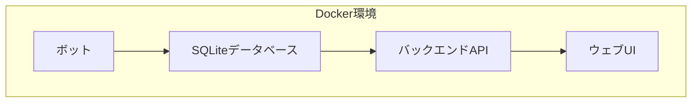

# 取引データ閲覧用ウェブUI実装計画

## 現状の分析

1. **データベース構造**
   - SQLiteデータベース（`data/trade_records.db`）
   - `trade_records`テーブル: 各取引ペアごとの集計情報
   - `trade_history`テーブル: 個別の取引履歴

2. **アプリケーション構成**
   - Node.jsベースのトレーディングボット
   - `better-sqlite3`を使用したデータ管理
   - 複数のボットサービス（bot, hft, mm）がDockerで実行中

## ウェブUI実装計画

### 1. 基本アーキテクチャ



### 2. コンポーネント詳細

1. **バックエンドAPI（Node.js + Express）**
   - データベースからデータを取得・加工するREST API
   - 以下のエンドポイントを提供：
     - `/api/positions`: 現在のポジション情報
     - `/api/history`: 取引履歴データ
     - `/api/summary`: 取引の集計サマリー

2. **フロントエンド（HTML/CSS/JavaScript）**
   - シンプルなSPA（Single Page Application）
   - 以下の主要ビュー：
     - ダッシュボード：現在のポジションと収益の概要
     - 取引履歴：詳細な取引履歴テーブル（フィルタリング可能）
     - グラフ分析：時系列での取引とパフォーマンス表示
   - 使用ライブラリ：
     - Chart.js：グラフ表示
     - DataTables：テーブル表示と操作性向上

3. **Docker統合**
   - 既存の`docker-compose.yml`に新しいサービスを追加
   - APIサーバーとウェブサーバーを同一コンテナで提供
   - 既存のデータボリュームをマウント

### 3. 実装手順

1. **バックエンドAPI開発**
   - `src/api/`ディレクトリの作成
   - Express.jsセットアップ
   - データ取得用エンドポイント実装

2. **フロントエンド開発**
   - `src/web/`ディレクトリの作成
   - HTML/CSS/JSファイル作成
   - APIからのデータ取得と表示実装

3. **Docker設定更新**
   - `docker-compose.yml`に新サービス追加
   - 必要なポート公開設定

4. **テストと最適化**
   - 動作確認とUI調整
   - パフォーマンス最適化

### 4. フォルダ構造

```
harvest3/
│
├── src/
│   ├── api/                 # 新規: API関連コード
│   │   ├── index.js         # APIメインエントリーポイント
│   │   ├── routes.js        # ルート定義
│   │   └── controllers/     # APIコントローラー
│   │
│   ├── web/                 # 新規: ウェブUI関連ファイル
│   │   ├── index.html       # メインHTML
│   │   ├── css/             # スタイルシート
│   │   ├── js/              # フロントエンド JavaScript
│   │   └── assets/          # その他アセット
│   │
│   └── [既存ファイル]        # 既存のソースファイル
│
├── docker-compose.yml       # 更新: ウェブUIサービス追加
└── [その他既存ファイル]
```

### 5. 技術要素

- **バックエンド**
  - Node.js
  - Express.js：APIサーバー
  - better-sqlite3：データベース接続（既存）

- **フロントエンド**
  - HTML5/CSS3/JavaScript（ES6+）
  - Chart.js：グラフ描画
  - DataTables.js：テーブルの拡張機能
  - Fetch API：データ取得

- **インフラ**
  - Docker & Docker Compose
  - Nginxまたは組み込みExpressサーバー

## スケジュール予定

1. **準備フェーズ（1日）**
   - 環境セットアップ
   - 必要なライブラリ追加

2. **API開発（2日）**
   - データ取得API実装
   - テストとデバッグ

3. **フロントエンド開発（3日）**
   - ダッシュボード実装
   - テーブル・グラフ機能実装

4. **Docker統合とテスト（1日）**
   - Docker設定更新
   - 統合テスト

合計約1週間で実装可能と見込んでいます。