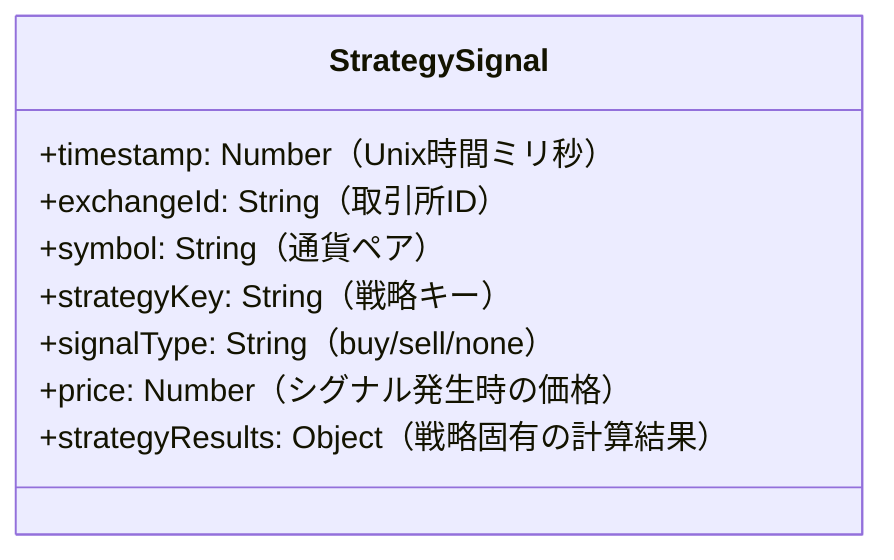

# 戦略シグナル履歴保存機能の実装計画（簡略版）

## 概要

各取引戦略が生成するシグナル（買い・売り・シグナルなし）を履歴としてRedisデータベースに保存し、後から時間順でソートしたり、特定の時間枠で検索できるようにする機能を実装します。

## データモデル



各戦略のstrategyResultsの例：
- MA戦略: `{ shortMA: 数値, longMA: 数値 }`
- MACD戦略: `{ macd: 数値, signal: 数値, histogram: 数値 }`
- RSI戦略: `{ rsi: 数値 }`
- ボリンジャーバンド戦略: `{ upper: 数値, middle: 数値, lower: 数値, bandwidth: 数値 }`

## Redis実装詳細

### データ保存構造

1. **シグナル履歴**:
   - キー: `strategy:signalHistory:{exchangeId}:{symbol}:{strategyKey}`
   - 型: Redis List
   - 値: シグナル情報のJSON文字列

2. **時系列インデックス**:
   - キー: `strategy:signalHistory:time`
   - 型: Redis Sorted Set
   - スコア: タイムスタンプ
   - 値: `{exchangeId}:{symbol}:{strategyKey}:{timestamp}`

## 実装コード

### redisDatabase.js に追加する関数

```javascript
/**
 * 戦略シグナルを記録する関数
 * @param {String} exchangeId - 取引所ID
 * @param {String} symbol - 通貨ペア
 * @param {String} strategyKey - 戦略キー
 * @param {String} signalType - シグナル種別 (buy/sell/none)
 * @param {Number} price - 現在価格
 * @param {Object} strategyResults - 戦略固有の計算結果
 * @returns {Promise} 処理完了時に解決されるPromise
 */
async function addStrategySignal(exchangeId, symbol, strategyKey, signalType, price, strategyResults = {}) {
  const now = Date.now();
  
  // インデックスセットに追加
  await client.sAdd('exchanges', exchangeId);
  await client.sAdd(`symbols:${exchangeId}`, symbol);
  await client.sAdd(`strategies:${exchangeId}:${symbol}`, strategyKey);
  
  // シグナル履歴キー
  const signalHistoryKey = `strategy:signalHistory:${exchangeId}:${symbol}:${strategyKey}`;
  
  // シグナルデータをJSONに変換
  const signalData = JSON.stringify({
    timestamp: now,
    signalType,
    price,
    strategyResults
  });
  
  // シグナル履歴を追加
  await client.rPush(signalHistoryKey, signalData);
  
  // 時系列インデックスに追加
  await client.zAdd('strategy:signalHistory:time', {
    score: now,
    value: `${exchangeId}:${symbol}:${strategyKey}:${now}`
  });
  
  // イベントを発火（UIなどに通知するため）
  const event = {
    type: 'strategy_signal_added',
    data: {
      exchangeId,
      symbol,
      strategyKey,
      signalType,
      price,
      timestamp: now,
      strategyResults
    }
  };
  
  // イベントをRedisに発行
  await client.publish('trade_events', JSON.stringify(event));
  
  return true;
}

/**
 * 戦略シグナル履歴を取得する関数
 * @param {Object} filters - フィルター条件
 * @param {Number} limit - 取得件数
 * @param {Number} offset - オフセット
 * @returns {Promise<Object>} 戦略シグナル履歴と合計件数
 */
async function getStrategySignalHistory(filters = {}, limit = 100, offset = 0) {
  const { exchangeId, symbol, strategyKey, startDate, endDate, signalType } = filters;
  
  let signalItems = [];
  let allSignals = []; // 全データを保持する変数
  
  if (exchangeId && symbol && strategyKey) {
    // 特定の取引所、通貨ペア、戦略の履歴を取得
    const signalHistoryKey = `strategy:signalHistory:${exchangeId}:${symbol}:${strategyKey}`;
    
    // 全データを取得
    const allData = await client.lRange(signalHistoryKey, 0, -1);
    
    // 全データをパースしてタイムスタンプでソート
    allSignals = allData.map(item => {
      const signal = JSON.parse(item);
      return {
        timestamp: Number(signal.timestamp),
        exchangeId,
        symbol,
        strategyKey,
        signalType: signal.signalType,
        price: signal.price,
        strategyResults: signal.strategyResults
      };
    });
    
    // 時間フィルタリング（startDateとendDateがある場合）
    if (startDate) {
      allSignals = allSignals.filter(item => item.timestamp >= startDate);
    }
    if (endDate) {
      allSignals = allSignals.filter(item => item.timestamp <= endDate);
    }
    
    // シグナルタイプでフィルタリング（指定されている場合）
    if (signalType) {
      allSignals = allSignals.filter(item => item.signalType === signalType);
    }
    
    // 降順（新しい順）にソート
    allSignals.sort((a, b) => b.timestamp - a.timestamp);
    
    // ページングを適用
    signalItems = allSignals.slice(offset, offset + limit);
  } else {
    // 時系列インデックスから取得
    let scoreMin = '-inf';
    let scoreMax = '+inf';
    
    if (startDate) {
      scoreMin = startDate;
    }
    
    if (endDate) {
      scoreMax = endDate;
    }
    
    // 時系列インデックスから全てのアイテムを取得
    const allTimeRangeItems = await client.zRangeByScore('strategy:signalHistory:time', scoreMin, scoreMax);
    
    // 全てのアイテムを処理
    for (const item of allTimeRangeItems) {
      const [itemExchangeId, itemSymbol, itemStrategyKey, timestamp] = item.split(':');
      
      // フィルター条件に一致するか確認
      if (exchangeId && itemExchangeId !== exchangeId) continue;
      if (symbol && itemSymbol !== symbol) continue;
      if (strategyKey && itemStrategyKey !== strategyKey) continue;
      
      // 履歴キー
      const signalHistoryKey = `strategy:signalHistory:${itemExchangeId}:${itemSymbol}:${itemStrategyKey}`;
      
      // インデックスを特定するのは難しいので、全て取得して検索
      const allHistory = await client.lRange(signalHistoryKey, 0, -1);
      
      for (const historyItem of allHistory) {
        const signal = JSON.parse(historyItem);
        
        // タイムスタンプが一致するものを探す
        if (signal.timestamp.toString() === timestamp) {
          // シグナルタイプでフィルタリング（指定されている場合）
          if (signalType && signal.signalType !== signalType) continue;
          
          allSignals.push({
            timestamp: Number(signal.timestamp),
            exchangeId: itemExchangeId,
            symbol: itemSymbol,
            strategyKey: itemStrategyKey,
            signalType: signal.signalType,
            price: signal.price,
            strategyResults: signal.strategyResults
          });
          break; // 見つかったら次のアイテムへ
        }
      }
    }
    
    // 降順（新しい順）にソート
    allSignals.sort((a, b) => b.timestamp - a.timestamp);
    
    // ページングを適用
    signalItems = allSignals.slice(offset, offset + limit);
  }
  
  return {
    count: allSignals.length,
    data: signalItems
  };
}
```

### APIコントローラーの実装

```javascript
/**
 * 戦略シグナル履歴コントローラー
 */
const { getStrategySignalHistory } = require('../../redisDatabase');

/**
 * 戦略シグナル履歴を取得するAPI
 */
async function getStrategySignals(req, res) {
  try {
    const { 
      exchange, 
      symbol, 
      strategy, 
      start_time, 
      end_time, 
      signal_type,
      limit = 100, 
      offset = 0 
    } = req.query;
    
    // フィルターの作成
    const filters = {};
    if (exchange) filters.exchangeId = exchange;
    if (symbol) filters.symbol = symbol;
    if (strategy) filters.strategyKey = strategy;
    if (signal_type) filters.signalType = signal_type;
    
    // 時間範囲の設定
    if (start_time) {
      // Unix時間（ミリ秒）かISO文字列かを自動判別
      filters.startDate = !isNaN(start_time) ? 
        parseInt(start_time) : 
        new Date(start_time).getTime();
    }
    
    if (end_time) {
      // Unix時間（ミリ秒）かISO文字列かを自動判別
      filters.endDate = !isNaN(end_time) ? 
        parseInt(end_time) : 
        new Date(end_time).getTime();
    }
    
    // 戦略シグナル履歴を取得
    const result = await getStrategySignalHistory(
      filters, 
      parseInt(limit), 
      parseInt(offset)
    );
    
    // 応答を返す
    res.json(result);
  } catch (error) {
    console.error('戦略シグナル履歴API処理中にエラーが発生しました:', error);
    res.status(500).json({ error: error.message });
  }
}

module.exports = {
  getStrategySignals
};
```

## 各戦略実装の修正

例として、MA戦略の場合：

```javascript
async function maStrategy(exchange, symbol, shortPeriod = 5, longPeriod = 20, amount, options = {}) {
  try {
    // 既存の処理...
    
    // 最新と1つ前の値を取得
    const currentShortMA = shortMA[shortMA.length - 1];
    const previousShortMA = shortMA[shortMA.length - 2];
    const currentLongMA = longMA[longMA.length - 1];
    const previousLongMA = longMA[longMA.length - 2];
    
    // 現在の価格を取得
    const ticker = await exchange.fetchTicker(symbol);
    const currentPrice = ticker.last;
    
    // クロスを検出
    const crossUp = previousShortMA < previousLongMA && currentShortMA > currentLongMA;
    const crossDown = previousShortMA > previousLongMA && currentShortMA < currentLongMA;
    
    // シグナルタイプを決定
    const signalType = crossUp ? 'buy' : (crossDown ? 'sell' : 'none');
    
    // 戦略固有の計算結果
    const strategyResults = {
      shortMA: currentShortMA,
      longMA: currentLongMA
    };
    
    // シグナル保存オプションがあれば実行
    if (options.saveStrategySignal) {
      await options.saveStrategySignal(
        exchange.id,
        symbol,
        'MA',
        signalType,
        currentPrice,
        strategyResults
      );
    }
    
    // 注文処理（既存コード）...
    
    return {
      strategy: 'MA Cross',
      symbol,
      shortMA: currentShortMA,
      longMA: currentLongMA,
      currentPrice,
      signal: signalType
    };
  } catch (error) {
    // エラー処理...
  }
}
```

## strategyRunner.js の修正

```javascript
const { addStrategySignal } = require('./redisDatabase');

async function runStrategy(strategyKey, exchange, symbol, options = {}) {
  try {
    // 既存のコード...
    
    // シグナル保存関数をオプションに追加
    const enhancedOptions = {
      ...options,
      saveStrategySignal: addStrategySignal
    };
    
    // 戦略パラメータの設定
    switch (strategyKey) {
      case 'MA':
        params.push(exchange, symbol, strategyConfig.shortPeriod, strategyConfig.longPeriod, config.amount, enhancedOptions);
        break;
      case 'MACD':
        params.push(exchange, symbol, strategyConfig.fastPeriod, strategyConfig.slowPeriod, strategyConfig.signalPeriod, config.amount, enhancedOptions);
        break;
      // その他の戦略...
    }
    
    // 戦略を実行
    return await strategies.executeStrategy(strategyKey, params);
  } catch (error) {
    // エラー処理...
  }
}
```

## APIルートの追加

`src/api/redis-routes.js` にルートを追加:

```javascript
// 戦略シグナルコントローラーをインポート
const { getStrategySignals } = require('./controllers/redis-strategy-signals');

// 戦略シグナル履歴API
router.get('/strategy-signals', getStrategySignals);
```

## 実装ステップ

1. **redisDatabase.js の修正**:
   - `addStrategySignal`関数を追加
   - `getStrategySignalHistory`関数を追加
   - モジュールのexportsに新関数を追加

2. **戦略関数の修正**:
   - 各戦略関数（maStrategy, macdStrategy等）を修正し、シグナル保存機能を追加
   - 戦略固有の計算結果を構造化して返すように修正

3. **strategyRunner.jsの修正**:
   - シグナル保存関数をオプションとして戦略関数に渡す処理を追加

4. **APIの実装**:
   - 新しいコントローラーの作成
   - APIルートの追加

このシンプルな計画では、各戦略が生成するシグナル情報をRedisに保存し、時間順でソートしたり特定の時間範囲で検索できるようにします。