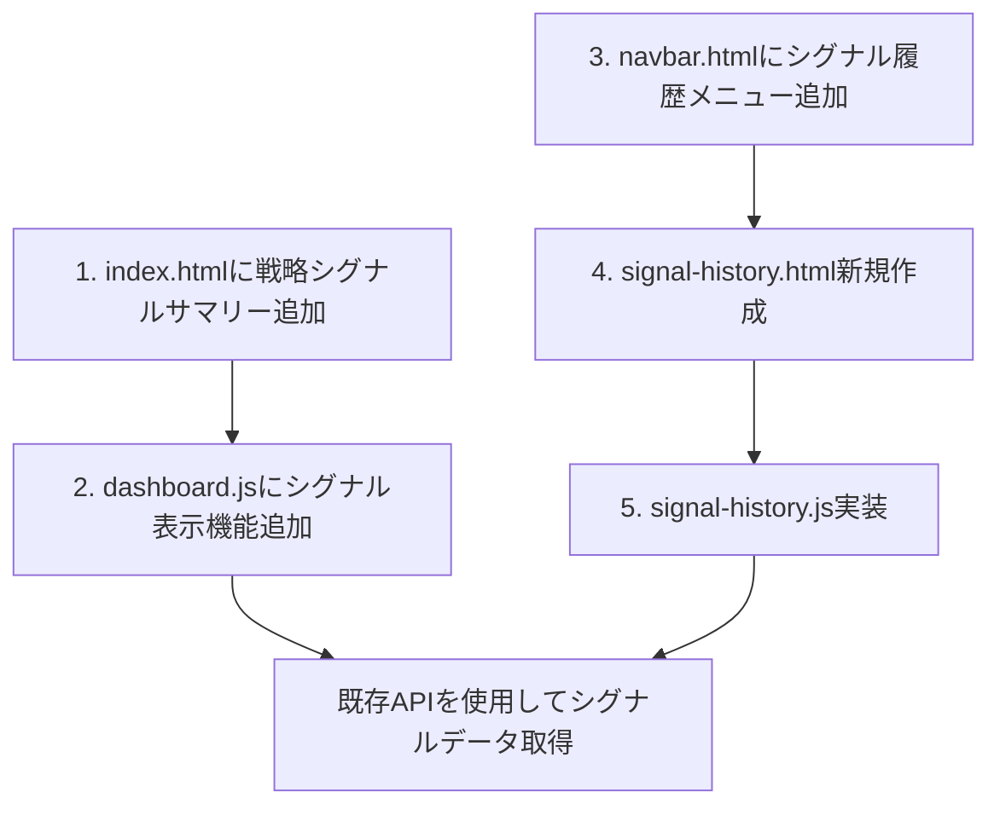

# Web UI機能追加計画: 戦略シグナル機能

## 現状分析と要件

1. **戦略シグナル履歴**:
   - 戦略シグナル（買い・売り・シグナルなし）のデータはRedisに保存済み
   - APIエンドポイント(/api/strategy-signals)が実装済み

2. **要件**:
   - index.htmlに戦略ごとのシグナルサマリーを追加
   - シグナル履歴ページを新規追加

## 実装計画



## 1. 戦略ごとのシグナルのサマリーをダッシュボードに追加

### A. HTML変更 (index.html)

既存の戦略別サマリーセクションの後に新しいセクションを追加します:

```html
<!-- 戦略シグナルサマリー -->
<div class="row mb-4">
    <div class="col-12">
        <div class="card">
            <div class="card-body">
                <h5 class="card-title d-flex justify-content-between align-items-center">
                    <span>戦略シグナルサマリー</span>
                    <a href="signal-history.html" class="btn btn-sm btn-outline-primary">詳細を表示</a>
                </h5>
                <div id="strategy-signals-container">
                    <div class="text-center py-3">
                        <div class="spinner-border text-primary" role="status">
                            <span class="visually-hidden">読み込み中...</span>
                        </div>
                    </div>
                </div>
            </div>
        </div>
    </div>
</div>
```

### B. JavaScript実装 (dashboard.js)

1. loadDashboardData() 関数を拡張してシグナルデータを読み込む機能を追加:

```javascript
function loadDashboardData() {
  loadPositions();
  loadSummary();
  loadOrderPairsSummary();
  loadRecentTrades();
  loadStrategySignals(); // 新しく追加
}
```

2. シグナルデータを取得して表示する関数を実装:

```javascript
/**
 * 戦略シグナルデータを読み込んで表示
 */
function loadStrategySignals() {
  const container = document.getElementById('strategy-signals-container');
  
  // ローディング表示
  container.innerHTML = `
    <div class="text-center py-3">
      <div class="spinner-border text-primary" role="status">
        <span class="visually-hidden">読み込み中...</span>
      </div>
    </div>
  `;
  
  // APIからデータ取得
  fetch('/api/strategy-signals?limit=100')
    .then(response => response.json())
    .then(data => {
      // 最新のシグナルのみを戦略ごとに抽出
      displayStrategySignals(data, container);
    })
    .catch(error => {
      console.error('戦略シグナル情報の取得に失敗しました:', error);
      const errorHTML = `
        <div class="alert alert-danger" role="alert">
          戦略シグナル情報の取得に失敗しました。詳細はコンソールを確認してください。
        </div>
      `;
      container.innerHTML = errorHTML;
    });
}

/**
 * 戦略シグナルデータを表示
 * @param {Object} data - APIから取得したシグナルデータ
 * @param {HTMLElement} container - 表示するコンテナ要素
 */
function displayStrategySignals(data, container) {
  if (!data.data || data.data.length === 0) {
    container.innerHTML = `
      <div class="no-data-message">
        <p>表示するシグナルデータがありません</p>
      </div>
    `;
    return;
  }
  
  // 戦略ごとに最新のシグナルだけを抽出
  const latestSignals = {};
  
  data.data.forEach(signal => {
    const key = `${signal.exchangeId}:${signal.symbol}:${signal.strategyKey}`;
    
    if (!latestSignals[key] || signal.timestamp > latestSignals[key].timestamp) {
      latestSignals[key] = signal;
    }
  });
  
  // 戦略ごとにグループ化
  const groupedByStrategy = {};
  
  Object.values(latestSignals).forEach(signal => {
    if (!groupedByStrategy[signal.strategyKey]) {
      groupedByStrategy[signal.strategyKey] = [];
    }
    groupedByStrategy[signal.strategyKey].push(signal);
  });
  
  let html = '<div class="strategy-signals-grid">';
  
  // 各戦略のシグナルを表示
  Object.keys(groupedByStrategy).sort().forEach(strategyKey => {
    const signals = groupedByStrategy[strategyKey];
    
    html += `
      <div class="strategy-signal-group mb-3">
        <h6 class="strategy-name">${strategyKey}</h6>
        <div class="signals-container">
    `;
    
    // 各シグナルを表示
    signals.forEach(signal => {
      const signalClass = signal.signalType === 'buy' ? 'signal-buy' : 
                         signal.signalType === 'sell' ? 'signal-sell' : 'signal-none';
      const signalIcon = signal.signalType === 'buy' ? '↑' : 
                        signal.signalType === 'sell' ? '↓' : '→';
      const signalText = signal.signalType === 'buy' ? '買い' : 
                        signal.signalType === 'sell' ? '売り' : 'シグナルなし';
      
      // シグナル発生時間をフォーマット
      const date = new Date(signal.timestamp);
      const formattedDate = date.toLocaleString('ja-JP', {
        month: 'numeric',
        day: 'numeric',
        hour: '2-digit',
        minute: '2-digit'
      });
      
      html += `
        <div class="signal-item ${signalClass}">
          <div class="signal-header">
            <span class="signal-symbol">${signal.symbol}</span>
            <span class="signal-exchange">${signal.exchangeId}</span>
          </div>
          <div class="signal-content">
            <span class="signal-icon">${signalIcon}</span>
            <span class="signal-type">${signalText}</span>
            <span class="signal-price">${signal.price.toLocaleString()} 円</span>
          </div>
          <div class="signal-footer">
            <span class="signal-time">${formattedDate}</span>
          </div>
        </div>
      `;
    });
    
    html += `
        </div>
      </div>
    `;
  });
  
  html += '</div>';
  
  container.innerHTML = html;
}
```

## 2. シグナル履歴ページの新規追加

### A. ナビゲーションバー更新 (navbar.html)

```html
<ul class="navbar-nav">
    <!-- 既存のメニュー項目 -->
    <li class="nav-item">
        <a class="nav-link" href="signal-history.html" id="nav-signal-history">シグナル履歴</a>
    </li>
</ul>
```

### B. HTML実装 (signal-history.html)

```html
<!DOCTYPE html>
<html lang="ja">
<head>
    <meta charset="UTF-8">
    <meta name="viewport" content="width=device-width, initial-scale=1.0">
    <title>シグナル履歴 - 取引データ閲覧</title>
    <!-- Bootstrap CSS -->
    <link href="https://cdn.jsdelivr.net/npm/bootstrap@5.3.0/dist/css/bootstrap.min.css" rel="stylesheet">
    <!-- カスタムCSS -->
    <link href="css/style.css" rel="stylesheet">
    <!-- データテーブル -->
    <link href="https://cdn.datatables.net/1.13.1/css/dataTables.bootstrap5.min.css" rel="stylesheet">
</head>
<body>
    <!-- ナビゲーションバーコンテナ -->
    <div id="navbar-container"></div>

    <!-- メインコンテンツ -->
    <div class="container-fluid mt-4">
        <!-- フィルターパネル -->
        <div class="row mb-4">
            <div class="col-12">
                <div class="card">
                    <div class="card-body">
                        <h5 class="card-title">フィルター</h5>
                        <form id="signal-filter-form" class="row g-3">
                            <div class="col-md-2">
                                <label for="exchange-filter" class="form-label">取引所</label>
                                <select id="exchange-filter" class="form-select">
                                    <option value="">すべて</option>
                                </select>
                            </div>
                            <div class="col-md-2">
                                <label for="symbol-filter" class="form-label">銘柄</label>
                                <select id="symbol-filter" class="form-select">
                                    <option value="">すべて</option>
                                </select>
                            </div>
                            <div class="col-md-2">
                                <label for="strategy-filter" class="form-label">戦略</label>
                                <select id="strategy-filter" class="form-select">
                                    <option value="">すべて</option>
                                </select>
                            </div>
                            <div class="col-md-2">
                                <label for="signal-type-filter" class="form-label">シグナルタイプ</label>
                                <select id="signal-type-filter" class="form-select">
                                    <option value="">すべて</option>
                                    <option value="buy">買い</option>
                                    <option value="sell">売り</option>
                                    <option value="none">シグナルなし</option>
                                </select>
                            </div>
                            <div class="col-md-2">
                                <label for="start-date" class="form-label">開始日時</label>
                                <input type="datetime-local" id="start-date" class="form-control">
                            </div>
                            <div class="col-md-2">
                                <label for="end-date" class="form-label">終了日時</label>
                                <input type="datetime-local" id="end-date" class="form-control">
                            </div>
                            <div class="col-12">
                                <button type="submit" class="btn btn-primary">適用</button>
                                <button type="button" id="reset-filter" class="btn btn-outline-secondary">リセット</button>
                            </div>
                        </form>
                    </div>
                </div>
            </div>
        </div>

        <!-- シグナル履歴テーブル -->
        <div class="row mb-4">
            <div class="col-12">
                <div class="card">
                    <div class="card-body">
                        <h5 class="card-title">シグナル履歴</h5>
                        <div class="table-responsive">
                            <table id="signals-table" class="table table-striped">
                                <thead>
                                    <tr>
                                        <th>日時</th>
                                        <th>取引所</th>
                                        <th>銘柄</th>
                                        <th>戦略</th>
                                        <th>シグナル</th>
                                        <th>価格</th>
                                        <th>詳細</th>
                                    </tr>
                                </thead>
                                <tbody id="signals-tbody">
                                    <!-- APIから取得したデータがここに表示されます -->
                                </tbody>
                            </table>
                        </div>
                        
                        <!-- ページネーション -->
                        <div id="signals-pagination" class="d-flex justify-content-between align-items-center mt-3">
                            <div>
                                <span id="showing-records">0件中0件を表示</span>
                            </div>
                            <nav aria-label="シグナル履歴ページネーション">
                                <ul class="pagination pagination-sm mb-0">
                                </ul>
                            </nav>
                        </div>
                    </div>
                </div>
            </div>
        </div>
    </div>

    <!-- シグナル詳細モーダル -->
    <div class="modal fade" id="signal-detail-modal" tabindex="-1" aria-labelledby="signal-detail-modal-label" aria-hidden="true">
        <div class="modal-dialog modal-lg">
            <div class="modal-content">
                <div class="modal-header">
                    <h5 class="modal-title" id="signal-detail-modal-label">シグナル詳細</h5>
                    <button type="button" class="btn-close" data-bs-dismiss="modal" aria-label="Close"></button>
                </div>
                <div class="modal-body" id="signal-detail-content">
                </div>
                <div class="modal-footer">
                    <button type="button" class="btn btn-secondary" data-bs-dismiss="modal">閉じる</button>
                </div>
            </div>
        </div>
    </div>

    <!-- JavaScript ライブラリ -->
    <script src="https://code.jquery.com/jquery-3.7.0.min.js"></script>
    <script src="https://cdn.jsdelivr.net/npm/bootstrap@5.3.0/dist/js/bootstrap.bundle.min.js"></script>
    <script src="https://cdn.datatables.net/1.13.1/js/jquery.dataTables.min.js"></script>
    <script src="https://cdn.datatables.net/1.13.1/js/dataTables.bootstrap5.min.js"></script>

    <!-- カスタムJavaScript -->
    <script src="js/navbar.js"></script>
    <script src="js/realtime.js"></script>
    <script src="js/signal-history.js"></script>
</body>
</html>
```

### C. JavaScript実装 (signal-history.js)

```javascript
/**
 * シグナル履歴画面の機能を制御するスクリプト
 */

// グローバル変数
let allSignals = []; // すべてのシグナルデータを保持
let currentPage = 1;
let signalsPerPage = 20;
let totalPages = 1;
let filters = {}; // フィルター条件を保持

// 初期化関数
function initSignalHistory() {
  console.log('シグナル履歴ページの初期化を開始します');
  
  // フィルターフォームのイベントリスナーを設定
  setupFilterForm();
  
  // 初期データの読み込み
  loadSignalHistoryData();
  
  // 取引所・銘柄・戦略のフィルターオプションを読み込み
  loadFilterOptions();
  
  // リアルタイム更新の設定
  setupRealtimeUpdates();
}

// スクリプトが読み込まれたら即時実行
if (document.readyState === 'loading') {
  document.addEventListener('DOMContentLoaded', initSignalHistory);
} else {
  // DOMはすでに読み込み済み
  initSignalHistory();
}

/**
 * フィルターフォームのセットアップ
 */
function setupFilterForm() {
  const form = document.getElementById('signal-filter-form');
  const resetButton = document.getElementById('reset-filter');
  
  // フォーム送信イベント
  form.addEventListener('submit', function(e) {
    e.preventDefault();
    
    // フィルター条件を取得
    filters = {
      exchange: document.getElementById('exchange-filter').value,
      symbol: document.getElementById('symbol-filter').value,
      strategy: document.getElementById('strategy-filter').value,
      signal_type: document.getElementById('signal-type-filter').value,
      start_time: document.getElementById('start-date').value ? new Date(document.getElementById('start-date').value).getTime() : '',
      end_time: document.getElementById('end-date').value ? new Date(document.getElementById('end-date').value).getTime() : ''
    };
    
    // ページをリセットして再読み込み
    currentPage = 1;
    loadSignalHistoryData();
  });
  
  // リセットボタンのイベント
  resetButton.addEventListener('click', function() {
    form.reset();
    filters = {};
    currentPage = 1;
    loadSignalHistoryData();
  });
}

/**
 * フィルターオプションを読み込む
 */
function loadFilterOptions() {
  // 取引所一覧を取得
  fetch('/api/exchanges')
    .then(response => response.json())
    .then(data => {
      const select = document.getElementById('exchange-filter');
      data.forEach(exchange => {
        const option = document.createElement('option');
        option.value = exchange;
        option.textContent = exchange;
        select.appendChild(option);
      });
    })
    .catch(error => console.error('取引所一覧の取得に失敗しました:', error));
  
  // 他のフィルターオプションも同様に実装
}

/**
 * シグナル履歴データを読み込む
 */
function loadSignalHistoryData() {
  // テーブルボディを取得
  const tbody = document.getElementById('signals-tbody');
  
  // ローディング表示
  tbody.innerHTML = `
    <tr>
      <td colspan="7" class="text-center">
        <div class="spinner-border text-primary" role="status">
          <span class="visually-hidden">読み込み中...</span>
        </div>
      </td>
    </tr>
  `;
  
  // APIパラメータを構築
  const params = new URLSearchParams({
    limit: signalsPerPage,
    offset: (currentPage - 1) * signalsPerPage
  });
  
  // フィルター条件を追加
  Object.entries(filters).forEach(([key, value]) => {
    if (value) params.append(key, value);
  });
  
  // APIからデータ取得
  fetch(`/api/strategy-signals?${params.toString()}`)
    .then(response => response.json())
    .then(data => {
      allSignals = data.data;
      displaySignalHistory(data);
      updatePagination(data.count);
    })
    .catch(error => {
      console.error('シグナル履歴の取得に失敗しました:', error);
      tbody.innerHTML = `
        <tr>
          <td colspan="7" class="text-center">
            <div class="alert alert-danger" role="alert">
              シグナル履歴の取得に失敗しました。詳細はコンソールを確認してください。
            </div>
          </td>
        </tr>
      `;
    });
}

/**
 * シグナル履歴を表示
 */
function displaySignalHistory(data) {
  const tbody = document.getElementById('signals-tbody');
  
  // データがない場合
  if (!data.data || data.data.length === 0) {
    tbody.innerHTML = `
      <tr>
        <td colspan="7" class="text-center">表示するデータがありません</td>
      </tr>
    `;
    
    document.getElementById('showing-records').textContent = '0件中0件を表示';
    return;
  }
  
  // データ表示
  let html = '';
  
  data.data.forEach(signal => {
    // シグナルタイプに応じたクラスとテキスト
    const signalClass = signal.signalType === 'buy' ? 'bg-success' :
                      signal.signalType === 'sell' ? 'bg-danger' : 'bg-secondary';
    const signalText = signal.signalType === 'buy' ? '買い' :
                      signal.signalType === 'sell' ? '売り' : 'シグナルなし';
    
    // 日時フォーマット
    const date = new Date(signal.timestamp);
    const formattedDate = date.toLocaleString('ja-JP');
    
    html += `
      <tr data-signal-index="${data.data.indexOf(signal)}">
        <td>${formattedDate}</td>
        <td>${signal.exchangeId}</td>
        <td>${signal.symbol}</td>
        <td>${signal.strategyKey}</td>
        <td><span class="badge ${signalClass}">${signalText}</span></td>
        <td>${signal.price.toLocaleString()} 円</td>
        <td>
          <button class="btn btn-sm btn-outline-primary signal-detail-btn"
                  data-bs-toggle="modal" data-bs-target="#signal-detail-modal">
            詳細
          </button>
        </td>
      </tr>
    `;
  });
  
  tbody.innerHTML = html;
  
  // 表示件数更新
  const start = (currentPage - 1) * signalsPerPage + 1;
  const end = Math.min(start + data.data.length - 1, data.count);
  document.getElementById('showing-records').textContent = `${data.count}件中${start}〜${end}件を表示`;
  
  // 詳細ボタンのイベントリスナーを設定
  document.querySelectorAll('.signal-detail-btn').forEach(btn => {
    btn.addEventListener('click', function() {
      const row = this.closest('tr');
      const index = parseInt(row.getAttribute('data-signal-index'));
      showSignalDetail(data.data[index]);
    });
  });
}

/**
 * シグナル詳細モーダルを表示
 */
function showSignalDetail(signal) {
  const modalContent = document.getElementById('signal-detail-content');
  
  // シグナルタイプに応じたクラスとテキスト
  const signalClass = signal.signalType === 'buy' ? 'bg-success' :
                     signal.signalType === 'sell' ? 'bg-danger' : 'bg-secondary';
  const signalText = signal.signalType === 'buy' ? '買い' :
                     signal.signalType === 'sell' ? '売り' : 'シグナルなし';
  
  // 日時フォーマット
  const date = new Date(signal.timestamp);
  const formattedDate = date.toLocaleString('ja-JP');
  
  let html = `
    <div class="signal-detail">
      <h6>基本情報</h6>
      <table class="table table-sm">
        <tr>
          <th>日時</th>
          <td>${formattedDate}</td>
        </tr>
        <tr>
          <th>取引所</th>
          <td>${signal.exchangeId}</td>
        </tr>
        <tr>
          <th>銘柄</th>
          <td>${signal.symbol}</td>
        </tr>
        <tr>
          <th>戦略</th>
          <td>${signal.strategyKey}</td>
        </tr>
        <tr>
          <th>シグナル</th>
          <td><span class="badge ${signalClass}">${signalText}</span></td>
        </tr>
        <tr>
          <th>価格</th>
          <td>${signal.price.toLocaleString()} 円</td>
        </tr>
      </table>
  `;
  
  // 戦略固有の計算結果があれば表示
  if (signal.strategyResults && Object.keys(signal.strategyResults).length > 0) {
    html += `
      <h6>計算結果</h6>
      <table class="table table-sm">
    `;
    
    Object.entries(signal.strategyResults).forEach(([key, value]) => {
      html += `
        <tr>
          <th>${key}</th>
          <td>${typeof value === 'number' ? value.toLocaleString() : value}</td>
        </tr>
      `;
    });
    
    html += '</table>';
  }
  
  html += '</div>';
  modalContent.innerHTML = html;
}

/**
 * ページネーションを更新
 */
function updatePagination(totalCount) {
  const paginationContainer = document.querySelector('#signals-pagination .pagination');
  
  // 総ページ数を計算
  totalPages = Math.ceil(totalCount / signalsPerPage);
  
  if (totalPages <= 1) {
    // ページが1つしかない場合はページネーション非表示
    paginationContainer.innerHTML = '';
    return;
  }
  
  let paginationHtml = '';
  
  // 前へボタン
  paginationHtml += `
    <li class="page-item ${currentPage === 1 ? 'disabled' : ''}">
      <a class="page-link" href="#" data-page="${currentPage - 1}" aria-label="前へ">
        <span aria-hidden="true">&laquo;</span>
      </a>
    </li>
  `;
  
  // ページ番号
  // 表示するページ番号範囲を決定
  let startPage = Math.max(1, currentPage - 2);
  let endPage = Math.min(totalPages, startPage + 4);
  startPage = Math.max(1, endPage - 4);
  
  if (startPage > 1) {
    paginationHtml += `
      <li class="page-item">
        <a class="page-link" href="#" data-page="1">1</a>
      </li>
    `;
    
    if (startPage > 2) {
      paginationHtml += `
        <li class="page-item disabled">
          <a class="page-link" href="#">...</a>
        </li>
      `;
    }
  }
  
  for (let i = startPage; i <= endPage; i++) {
    paginationHtml += `
      <li class="page-item ${i === currentPage ? 'active' : ''}">
        <a class="page-link" href="#" data-page="${i}">${i}</a>
      </li>
    `;
  }
  
  if (endPage < totalPages) {
    if (endPage < totalPages - 1) {
      paginationHtml += `
        <li class="page-item disabled">
          <a class="page-link" href="#">...</a>
        </li>
      `;
    }
    
    paginationHtml += `
      <li class="page-item">
        <a class="page-link" href="#" data-page="${totalPages}">${totalPages}</a>
      </li>
    `;
  }
  
  // 次へボタン
  paginationHtml += `
    <li class="page-item ${currentPage === totalPages ? 'disabled' : ''}">
      <a class="page-link" href="#" data-page="${currentPage + 1}" aria-label="次へ">
        <span aria-hidden="true">&raquo;</span>
      </a>
    </li>
  `;
  
  paginationContainer.innerHTML = paginationHtml;
  
  // ページネーションのクリックイベントを設定
  document.querySelectorAll('#signals-pagination .page-link').forEach(link => {
    link.addEventListener('click', (e) => {
      e.preventDefault();
      const page = parseInt(e.target.getAttribute('data-page') || e.target.parentElement.getAttribute('data-page'));
      if (!isNaN(page) && page > 0 && page <= totalPages) {
        currentPage = page;
        loadSignalHistoryData();
      }
    });
  });
}

/**
 * リアルタイム更新のセットアップ
 */
function setupRealtimeUpdates() {
  if (typeof setupEventSource === 'function') {
    // リアルタイム更新のイベントを購読
    setupEventSource('trade_events', (event) => {
      const data = JSON.parse(event.data);
      
      // 戦略シグナルイベントを処理
      if (data.type === 'strategy_signal_added') {
        processNewSignal(data.data);
      }
    });
  }
}

/**
 * 新しいシグナルを処理
 */
function processNewSignal(signal) {
  // フィルター条件に合致するか確認
  if (
    (filters.exchange && filters.exchange !== signal.exchangeId) ||
    (filters.symbol && filters.symbol !== signal.symbol) ||
    (filters.strategy && filters.strategy !== signal.strategyKey) ||
    (filters.signal_type && filters.signal_type !== signal.signalType) ||
    (filters.start_time && signal.timestamp < filters.start_time) ||
    (filters.end_time && signal.timestamp > filters.end_time)
  ) {
    return; // フィルター条件に一致しない場合は何もしない
  }
  
  // 現在のページが1ページ目の場合のみ表示を更新
  if (currentPage === 1) {
    // 最新シグナルを追加して再表示
    allSignals.unshift(signal);
    allSignals = allSignals.slice(0, signalsPerPage);
    
    displaySignalHistory({
      data: allSignals,
      count: parseInt(document.getElementById('showing-records').textContent.split('件中')[0]) + 1
    });
  } else {
    // 1ページ目以外の場合は、新しいシグナルがあることを通知
    const notification = document.createElement('div');
    notification.className = 'alert alert-info alert-dismissible fade show mt-2';
    notification.innerHTML = `
      新しいシグナルが追加されました。
      <a href="#" class="alert-link" id="reload-first-page">1ページ目に戻る</a>
      <button type="button" class="btn-close" data-bs-dismiss="alert" aria-label="閉じる"></button>
    `;
    
    const container = document.querySelector('.card-body');
    container.insertBefore(notification, container.firstChild);
    
    // 1ページ目に戻るリンクのイベント
    document.getElementById('reload-first-page').addEventListener('click', (e) => {
      e.preventDefault();
      currentPage = 1;
      loadSignalHistoryData();
    });
  }
}
```

## CSS追加 (style.css)

既存のCSSファイルに以下のスタイルを追加します:

```css
/* 戦略シグナル関連のスタイル */
.strategy-signals-grid {
  display: grid;
  grid-template-columns: repeat(auto-fill, minmax(300px, 1fr));
  gap: 15px;
}

.signals-container {
  display: flex;
  flex-wrap: wrap;
  gap: 10px;
}

.signal-item {
  border: 1px solid #ddd;
  border-radius: 4px;
  padding: 8px;
  min-width: 140px;
}

.signal-buy {
  border-left: 4px solid #28a745;
  background-color: rgba(40, 167, 69, 0.1);
}

.signal-sell {
  border-left: 4px solid #dc3545;
  background-color: rgba(220, 53, 69, 0.1);
}

.signal-none {
  border-left: 4px solid #6c757d;
  background-color: rgba(108, 117, 125, 0.1);
}

.signal-header, .signal-content, .signal-footer {
  display: flex;
  justify-content: space-between;
  align-items: center;
}

.signal-content {
  margin: 5px 0;
}

.signal-symbol {
  font-weight: bold;
}

.signal-exchange {
  font-size: 0.8em;
  color: #666;
}

.signal-icon {
  font-size: 1.2em;
  font-weight: bold;
}

.signal-time {
  font-size: 0.8em;
  color: #666;
}

/* シグナル履歴ページのスタイル */
.position-group-header {
  cursor: pointer;
  padding: 8px;
  background-color: #f8f9fa;
  border-radius: 4px;
}

.position-group-header h6 {
  display: flex;
  justify-content: space-between;
  align-items: center;
  margin: 0;
}
```

## 実装手順

1. index.htmlに「戦略シグナルサマリー」セクションを追加
2. dashboard.jsに戦略シグナルデータを取得・表示する機能を実装
3. navbar.htmlに「シグナル履歴」メニュー項目を追加
4. signal-history.htmlを新規作成
5. signal-history.js実装
6. style.cssに必要なスタイルを追加
7. 各機能のテストと調整